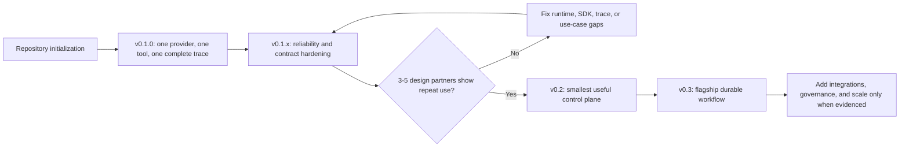

# Corex AgentOS Roadmap

Open-source infrastructure for building, orchestrating, executing, governing, tracing, and evaluating production AI agents.

Corex AgentOS is being developed incrementally, starting with a reliable agent execution foundation and evolving toward a distributed, self-hosted AI agent platform.

The roadmap prioritizes working software, stable contracts, observability, security, and developer experience over premature infrastructure complexity.

---

## Vision

Corex AgentOS aims to provide a common operational layer between AI agents and the systems they interact with.

```text
Developer / Application
          │
          ▼
     Corex AgentOS
          │
    ┌─────┼─────┐
    ▼     ▼     ▼
  Agents Models Tools
          │
          ▼
 MCP / APIs / Databases / Services
```

The platform should make it possible to:

- Define and version AI agents.
- Connect agents to different model providers.
- Integrate tools through MCP.
- Build multi-agent workflows.
- Execute agents reliably.
- Control tool permissions.
- Require human approval for sensitive actions.
- Trace model and tool activity.
- Monitor tokens, latency, and cost.
- Evaluate agent behavior and output quality.
- Run workloads across distributed workers.
- Self-host the complete platform.

---

## Release Strategy

```text
v0.1  Execution Foundation
  ↓
v0.2  Control Plane
  ↓
v0.3  Workflow Engine
  ↓
v0.4  MCP + Knowledge
  ↓
v0.5  Governance + Evaluations
  ↓
v0.6  Distributed Runtime
  ↓
v0.7  AgentOps
  ↓
v0.8  Developer Platform
  ↓
v0.9  Production Hardening
  ↓
v1.0  Production Platform
```

Each release should remain usable independently.

Features may move between releases as the architecture evolves.

## Delivery Model and Evidence Gates

The architecture documents describe the destination. They do not authorize
building every plane at once. Delivery proceeds through the smallest complete
vertical slice that produces working software and customer evidence.



Delivery rules:

- Complete one end-to-end path before adding breadth.
- Support one model provider and one representative tool before adding more
  providers or integrations.
- Capture a useful execution trace from the first runnable release.
- Keep contracts provider-independent even when only one adapter exists.
- Add a control plane only after local runtime usage repeats outside the core
  team.
- Add workflow infrastructure only after single-agent execution is reliable.
- Add PostgreSQL, NATS, Redis, Kubernetes, and GitOps components only in the
  releases that need their operational properties.
- Treat design-partner evidence as a release input, not as marketing after the
  architecture is already built.
- Move, narrow, or remove features when evidence does not justify them.

### Release Gates

| Release | Required entry evidence | Required exit evidence |
| --- | --- | --- |
| v0.1 | Repository and Python package initialize successfully | One useful local agent repeatedly calls one tool and produces a complete trace |
| v0.2 | v0.1 reliability plus repeat use by 3-5 design partners | A team can manage versions and inspect centrally persisted runs |
| v0.3 | Customers need multi-step work that cannot be handled reliably by one agent | The flagship workflow survives a controlled node failure and resumes safely |
| v0.4 | Real workflows require reusable external tools or project knowledge | One MCP and one knowledge integration improve a measured workflow outcome |
| v0.5 | A design partner requires enforceable controls or repeatable quality gates | A sensitive action is governed and a candidate version passes a repeatable evaluation gate |
| v0.6 | Measured concurrency or reliability exceeds a single runtime process | Work survives worker failure without duplicate terminal effects |
| v0.7 | Users cannot diagnose behavior efficiently from existing run events | A failed run can be explained from traces without raw application-log investigation |
| v0.8 | Multiple external teams need stable integration and extension contracts | SDK, API, event, and plugin compatibility is tested and documented |
| v0.9 | Reference deployments expose concrete production risks | Security, resilience, performance, migration, and release tests pass |
| v1.0 | Repeat production deployments and upgrade evidence exist | A team can deploy, upgrade, govern, observe, and recover the self-hosted platform |

Passing a technical checklist without the required usage evidence does not
automatically start the next release.

---

## v0.1 — Execution Foundation

**Goal:** Execute a real AI agent locally with models and tools while capturing its complete execution trace.

### Delivery Sequence

#### v0.1.0 — Golden Vertical Slice

Implement only the shortest useful path:

- Minimal Python SDK and runtime.
- One OpenAI-compatible model adapter.
- One representative, read-only repository tool.
- One model-to-tool-to-model loop.
- In-process structured event collection.
- One inspectable run result containing output, model activity, tool activity,
  tokens, latency, errors, duration, and estimated cost.
- One runnable repository-analysis example.
- Deterministic fake-model and fake-tool tests for the same path.

Do not require PostgreSQL, NATS, Redis, Kubernetes, a control plane, the portal,
MCP, multi-agent workflows, persistent memory, or enterprise authentication for
this milestone.

#### v0.1.1 — Reliability

After the golden path works, add:

- Structured input and output validation.
- Streaming.
- Timeout and cancellation propagation.
- Normalized runtime, provider, and tool errors.
- Safe retry classification with bounded backoff.
- Token, cost, deadline, tool-call, and iteration limits.
- Trace completeness and failure-path tests.

#### v0.1.2 — Portability

After reliability is demonstrated:

- Add provider contract tests.
- Add Anthropic as the second provider.
- Add Ollama/local models only after the same contract passes.
- Add model fallback only after two providers have compatible, observable
  behavior.
- Add more tools only when they exercise a new contract or a validated use case.

### Agent Runtime

- Python agent runtime.
- Agent lifecycle.
- Agent execution context.
- Agent configuration.
- System instructions.
- Structured agent input/output.
- Cancellation.
- Execution timeout.
- Retry handling.
- Runtime error model.

### Model Layer

Create a provider-independent model interface.

Golden-path provider:

- OpenAI-compatible APIs.

Follow-on providers after the reliability gate:

- Anthropic.
- Ollama/local models.

Support:

- Chat completion.
- Streaming.
- Structured output.
- Tool calling.
- Token usage collection.
- Provider errors.
- Timeout handling.
- Model fallback.

### Tool Runtime

Implement the initial tool abstraction.

```text
Agent
  │
  ▼
Tool Registry
  │
  ├── Tool A
  ├── Tool B
  └── Tool C
```

Support:

- Tool registration.
- JSON Schema arguments.
- Tool invocation.
- Tool results.
- Tool execution errors.
- Timeouts.
- Execution metadata.

### Observability Foundation

Every execution should generate structured events.

Initial event types:

```text
run.started
agent.started
model.requested
model.completed
tool.requested
tool.completed
agent.completed
run.completed
run.failed
```

Capture:

- Model.
- Tokens.
- Latency.
- Tool calls.
- Errors.
- Execution duration.
- Estimated model cost.

### Developer Experience

Provide a minimal Python SDK.

Example target API:

```python
from corex import Agent

agent = Agent(
    name="repository-analyzer",
    model="openai/gpt-5",
    instructions="Analyze the repository and answer engineering questions.",
    tools=[...],
)
result = agent.run(
    "Find the cause of the failing authentication tests."
)
```

### v0.1 Success Criteria

A developer can start from a clean environment, install the SDK, configure the
golden-path model, register the repository tool, execute the example, and
inspect a complete successful or failed execution trace.

Before v0.2 begins:

- the golden path passes deterministic contract and failure tests;
- repeated runs do not leak state or produce duplicate terminal events;
- trace fields are useful for diagnosing at least one real failure;
- 3-5 design partners attempt a real workflow and demonstrate repeat use or
  provide clear evidence of the gaps blocking repeat use.

---

## v0.2 — Control Plane

**Goal:** Manage agents and executions through a centralized API and developer portal.

### Entry Gate

Do not start the centralized platform merely because its architecture is
documented. Begin v0.2 only when v0.1 is reliable and design partners need
shared versions, durable run history, project access, or a portal for the same
working execution path.

### Go Control Plane

Introduce the Go-based control plane.

Core domains:

- Projects.
- Agents.
- Agent versions.
- Models.
- Tools.
- Credentials.
- Runs.
- Events.
- Usage.

### API

Provide versioned APIs.

```text
/api/v1/projects
/api/v1/agents
/api/v1/models
/api/v1/tools
/api/v1/runs
/api/v1/events
```

Support:

- REST API.
- Pagination.
- Filtering.
- Structured errors.
- Request validation.
- Idempotency where required.

### Persistence

Introduce PostgreSQL.

Persist:

- Projects.
- Agent definitions.
- Agent versions.
- Runs.
- Execution events.
- Tool metadata.
- Usage.

### Authentication

Initial authentication system.

Support:

- Local users.
- API keys.
- Project-scoped credentials.

Design authentication so external identity providers can be introduced later.

### Developer Portal

Launch the React + TypeScript + Vite portal.

Initial screens:

- Dashboard
- Projects
- Agents
- Agent Detail
- Runs
- Run Detail
- Models
- Tools
- Settings

### Run Explorer

Allow developers to inspect:

- Agent execution.
- Model calls.
- Tool calls.
- Errors.
- Duration.
- Tokens.
- Estimated cost.

### CLI

Introduce the corex CLI.

Initial commands:

```shell
corex login
corex project list
corex agent list
corex agent run
corex run get
corex run logs
```

### v0.2 Success Criteria

A small team can start Corex AgentOS, publish an immutable version of the same
v0.1 agent, execute it through the control plane, and inspect a durably stored
run through the portal. The centralized path must preserve the v0.1 runtime
contract rather than introduce a second execution implementation.

---

## v0.3 — Workflow Engine

**Goal:** Move from individual agents to reliable multi-agent workflows.

### Entry Gate

Begin workflow-engine work only after a design partner demonstrates a real
multi-step use case that the reliable single-agent and tool loop cannot express
or recover safely. Implement the smallest flagship DAG before a general visual
workflow builder.

### Workflow Specification

Introduce a versioned workflow definition.

Example:

```yaml
name: issue-fixer
nodes:
  - id: planner
    agent: planner-agent
  - id: developer
    agent: developer-agent
    depends_on:
      - planner
  - id: testing
    agent: testing-agent
    depends_on:
      - developer
  - id: review
    agent: review-agent
    depends_on:
      - testing
```

### Workflow Capabilities

Support:

- Sequential execution.
- Parallel execution.
- DAG dependencies.
- Conditional nodes.
- Agent nodes.
- Tool nodes.
- Human approval nodes.
- Workflow input/output.
- Shared workflow state.

### Reliability

Implement:

- Node retries.
- Retry backoff.
- Timeouts.
- Cancellation.
- Failure propagation.
- Resume.
- Idempotent execution.

### Workflow Versioning

Separate:

```text
Workflow
    │
    ├── Version 1
    ├── Version 2
    └── Version 3
```

Runs always reference an immutable workflow version.

### Scheduling

Support:

- Manual execution.
- Scheduled workflows.
- Cron schedules.

### Workflow UI

Add:

- Workflow list.
- Workflow editor.
- DAG visualization.
- Live execution status.
- Node details.
- Failure inspection.

### v0.3 Success Criteria

Corex AgentOS can reliably execute a multi-agent workflow and recover from controlled node failures.

---

## v0.4 — MCP + Knowledge

**Goal:** Make external capabilities and knowledge first-class platform concepts.

### MCP

Adopt Model Context Protocol as the primary external tool integration mechanism.

Support:

- MCP server registration.
- Tool discovery.
- MCP client lifecycle.
- Tool schemas.
- MCP server health.
- Connection configuration.
- Tool execution tracing.

Initial transports should follow the supported MCP specification.

### MCP Registry

Developers should be able to register an MCP server and selectively expose its tools to agents.

```text
MCP Server
    │
    ├── read_repository
    ├── search_code
    ├── create_branch
    └── create_pull_request
```

### Knowledge Sources

Introduce reusable knowledge sources.

Support:

- Files.
- Documents.
- Repository content.
- Web/API content.
- Structured records.

### RAG Pipeline

Provide modular:

```text
Source
  ↓
Ingestion
  ↓
Chunking
  ↓
Embedding
  ↓
Vector Store
  ↓
Retrieval
  ↓
Reranking
  ↓
Agent Context
```

Initial vector storage:

- PostgreSQL + pgvector.

Design adapters for additional stores.

### Memory

Introduce:

- Run-scoped memory.
- Agent memory.
- Conversation memory.
- Persistent memory interfaces.

Memory must remain explicit and inspectable.

### v0.4 Success Criteria

An agent can discover MCP tools, retrieve relevant project knowledge and use both during a traced workflow execution.

---

## v0.5 — Governance + Evaluations

**Goal:** Make agent execution controllable and measurable.

### Policy Engine

Introduce execution policies.

Policies may target:

- Agents.
- Models.
- Tools.
- MCP servers.
- Projects.
- Workflows.

Example:

```yaml
policies:
  - tool: github.read_file
    effect: allow
  - tool: github.push
    effect: require_approval
  - tool: github.merge_pull_request
    effect: deny
```

### Human Approval

Support approval gates for sensitive actions.

Lifecycle:

```text
Agent requests action
        ↓
Policy evaluation
        ↓
Approval required
        ↓
Workflow suspended
        ↓
Human reviews request
        ↓
Approve / Reject
        ↓
Workflow continues / stops
```

Capture:

- Requesting agent.
- Requested operation.
- Tool arguments.
- Reason.
- Approver.
- Decision.
- Timestamp.

### Budgets

Support limits for:

- Tokens.
- Model cost.
- Runtime duration.
- Tool calls.
- Agent iterations.

Example:

```yaml
budget:
  max_cost_usd: 2.00
  max_tokens: 200000
  max_tool_calls: 100
```

### Guardrails

Introduce hooks around:

- Agent input.
- Model input.
- Model output.
- Tool arguments.
- Tool output.
- Final output.

### Evaluation Framework

Support:

- Evaluation datasets.
- Test cases.
- Expected outcomes.
- LLM-based evaluators.
- Deterministic evaluators.
- Custom evaluators.
- Evaluation runs.
- Scores.

### Regression Testing

Compare agent/workflow versions against evaluation datasets before deployment.

### v0.5 Success Criteria

Teams can restrict agent actions, require human approval and evaluate agent changes against repeatable datasets.

---

## v0.6 — Distributed Runtime

**Goal:** Execute workloads reliably across multiple workers.

### Event Infrastructure

Introduce NATS JetStream for distributed task/event delivery.

Example architecture:

```text
             Go Control Plane
                    │
                    ▼
             NATS JetStream
                    │
       ┌────────────┼────────────┐
       ▼            ▼            ▼
   Worker 01    Worker 02    Worker 03
```

### Worker Runtime

Support:

- Worker registration.
- Heartbeats.
- Capabilities.
- Task claiming.
- Concurrency limits.
- Graceful shutdown.
- Task recovery.
- Worker draining.

### Queue Management

Support:

- Queue priorities.
- Dead-letter handling.
- Retry queues.
- Delayed execution.
- Backpressure.

### Redis

Use Redis where appropriate for:

- Short-lived coordination.
- Rate limits.
- Caching.
- Distributed locks when required.

Avoid using Redis as the source of truth for durable platform state.

### Runtime Isolation

Begin isolation support for tool/agent workloads.

Investigate:

- Containers.
- Sandboxed processes.
- Resource limits.

### v0.6 Success Criteria

A workflow can execute across multiple runtime workers while surviving individual worker failures.

---

## v0.7 — AgentOps

**Goal:** Provide deep operational visibility into agent behavior.

### Distributed Tracing

Standardize tracing around OpenTelemetry.

Trace hierarchy:

```text
Workflow Run
│
├── Agent Span
│   ├── Model Span
│   ├── Tool Span
│   └── Retrieval Span
│
└── Agent Span
    └── Model Span
```

### Trace Explorer

Portal capabilities:

- Trace waterfall.
- Agent timeline.
- Model requests.
- Tool calls.
- Retrieval events.
- Errors.
- Retries.
- Approval events.

### Cost Analytics

Provide:

- Cost per run.
- Cost per workflow.
- Cost per agent.
- Cost per project.
- Cost by model.
- Token trends.

### Run Comparison

Compare two executions by:

- Output.
- Agent versions.
- Models.
- Prompts/configuration.
- Tokens.
- Cost.
- Latency.
- Evaluation scores.

### Replay

Support safe execution replay.

Potential modes:

- Full replay.
- Replay from failed node.
- Replay with changed model.
- Replay with changed agent version.

Sensitive or side-effecting tool calls must never be blindly replayed.

### v0.7 Success Criteria

A developer can diagnose why an agent behaved incorrectly without relying on raw application logs.

---

## v0.8 — Developer Platform

**Goal:** Make Corex AgentOS easy to extend and integrate.

### SDKs

Stabilize:

- Python SDK.
- Go SDK.
- TypeScript API client.

### Plugin Architecture

Define extension points for:

- Model providers.
- MCP integrations.
- Vector stores.
- Evaluators.
- Guardrails.
- Authentication providers.
- Observability exporters.

### Webhooks

Provide signed lifecycle webhooks for events such as:

```text
run.started
run.completed
run.failed
approval.requested
approval.completed
evaluation.completed
```

### API Stability

Begin API compatibility guarantees.

Publish:

- OpenAPI specification.
- JSON schemas.
- Event schemas.
- Workflow specification.

### Developer Documentation

Create comprehensive documentation for:

- Quick start.
- Agent SDK.
- MCP.
- Workflows.
- Policies.
- Evaluations.
- Deployment.
- Plugin development.

### Example Library

Maintain production-quality examples including:

- Basic agent.
- Research agent.
- RAG assistant.
- Human approval workflow.
- Multi-agent workflow.
- GitHub issue fixer.

---

## v0.9 — Production Hardening

**Goal:** Prepare the architecture and security model for v1.0.

### Security

Implement or harden:

- RBAC.
- Project isolation.
- Secret encryption.
- Credential rotation.
- Audit logging.
- API rate limiting.
- Security headers.
- Dependency scanning.
- Container scanning.
- Supply-chain protections.

### Reliability

Test:

- Worker failure.
- NATS interruption.
- PostgreSQL interruption.
- Model provider failure.
- MCP server failure.
- Duplicate events.
- Network partitions.
- Long-running workflows.

### Performance

Establish benchmarks for:

- API throughput.
- Workflow scheduling.
- Event throughput.
- Worker concurrency.
- Trace ingestion.
- Database performance.

### Migration Safety

Guarantee:

- Database migration strategy.
- Backward-compatible schema changes where practical.
- Upgrade documentation.
- Rollback procedures.

### Release Engineering

Implement:

- Semantic versioning.
- Signed artifacts where practical.
- SBOM generation.
- Container publishing.
- Automated release notes.
- Upgrade tests.

---

## v1.0 — Production Self-Hosted Platform

**Goal:** Deliver a stable production-ready Corex AgentOS distribution.

### Kubernetes

Provide production Kubernetes deployment.

```text
Kubernetes Cluster
├── Corex Control Plane
├── Corex Runtime Workers
├── Corex Portal
├── PostgreSQL integration
├── NATS
├── Redis
└── OpenTelemetry Collector
```

### Helm

Publish an official Helm chart.

Support:

- Configurable replicas.
- Resource limits.
- Ingress.
- TLS.
- External PostgreSQL.
- External Redis.
- External NATS.
- Secret injection.
- Observability exporters.

### High Availability

Support horizontal scaling for stateless platform components.

Document HA requirements for stateful dependencies.

### Production Authentication

Provide integration points for external identity systems.

### Stable Contracts

v1.0 should establish stable versions of:

- Public REST API.
- Agent SDK.
- Workflow specification.
- Policy specification.
- Event model.
- Plugin interfaces.

### Operations

Provide:

- Health endpoints.
- Readiness checks.
- Metrics.
- Structured logging.
- Distributed tracing.
- Backup guidance.
- Disaster recovery guidance.
- Upgrade documentation.

### v1.0 Success Criteria

A team can deploy Corex AgentOS to its own infrastructure, connect agents and MCP tools, execute distributed workflows, enforce governance policies, inspect traces, evaluate behavior and operate the platform reliably.

---

## Flagship Workflow

The primary end-to-end reference workflow will be the GitHub Issue Fixer.

```text
GitHub Issue
     │
     ▼
Planner Agent
     │
     ▼
Repository Agent
     │
     ▼
Developer Agent
     │
     ▼
Testing Agent
     │
     ▼
Review Agent
     │
     ▼
Human Approval
     │
     ▼
PR Suggestion / Patch
```

Throughout the workflow Corex AgentOS records:

- Model calls.
- Tool calls.
- MCP activity.
- Agent transitions.
- Tokens.
- Cost.
- Latency.
- Errors.
- Retries.
- Policy decisions.
- Human approvals.
- Evaluation results.

The flagship workflow acts as an integration test for the platform and should evolve alongside every release.

---

## Beyond v1.0

The following ideas are intentionally outside the initial v1 scope.

### Runtime

- Advanced workload sandboxing.
- Ephemeral execution environments.
- GPU-aware workers.
- Specialized worker pools.
- Remote execution.
- Edge runtimes.

### Orchestration

- Dynamic workflow generation.
- Event-driven agents.
- Long-running durable agents.
- Advanced multi-agent coordination.
- Agent-to-agent communication protocols.

### Governance

- Organization-level policies.
- Advanced RBAC/ABAC.
- Compliance reporting.
- Policy simulation.
- Enterprise audit exports.

### AgentOps

- Automated anomaly detection.
- Prompt/configuration experiments.
- Evaluation trend analysis.
- Cost optimization recommendations.
- Production quality monitoring.

### Platform

- Multi-cluster execution.
- Multi-region deployments.
- Managed control-plane architecture.
- Enterprise SSO.
- Organization management.

These capabilities will be considered based on real-world usage and community feedback rather than being treated as mandatory architecture.

---

## Engineering Principles

### Working Software First

Every release should produce functionality developers can actually run.

Avoid creating infrastructure solely because it may become useful later.

### Modular Before Microservices

Corex AgentOS starts with strong module boundaries.

Services should be extracted only when scaling, ownership, reliability, or deployment requirements justify them.

### MCP First

External tool integrations should prefer open protocols and portable interfaces.

Avoid unnecessary vendor lock-in.

### Observable by Default

Agent execution should never be a black box.

Every important model, tool, workflow and policy operation should produce structured telemetry.

### Secure by Default

Agent permissions should follow least privilege.

Sensitive side effects should be controllable through policies and human approval.

### Provider Independent

Corex AgentOS should not depend on a single model provider, vector database, cloud provider or agent framework.

### Open Standards

Prefer technologies and standards such as:

- MCP.
- OpenTelemetry.
- OpenAPI.
- JSON Schema.
- OCI containers.
- Kubernetes.

### Self-Hosting First

Developers should always have a straightforward path to running Corex AgentOS locally and on their own infrastructure.

---

## Non-Goals

Corex AgentOS is not intended to become:

- A foundation model.
- A general-purpose chatbot builder.
- An IDE replacement.
- A Kubernetes replacement.
- A CI/CD platform.
- A generic cloud application platform.
- A proprietary agent framework that forces developers into one programming model.

The platform focuses on the operational lifecycle of AI agents.

---

## Current Priority

The current engineering priority is v0.1.0 — the golden vertical slice within
the Execution Foundation.

The slice uses one OpenAI-compatible provider, one read-only repository tool,
one model-to-tool-to-model loop, and one complete in-process trace. Provider
breadth, the control plane, workflows, MCP, persistence, and distributed
infrastructure are explicitly deferred until their gates are met.

Before expanding the architecture, Corex AgentOS should demonstrate one complete vertical slice:

```text
Define Agent
    ↓
Configure Model
    ↓
Register Tool
    ↓
Execute Agent
    ↓
Model calls Tool
    ↓
Tool returns Result
    ↓
Agent produces Output
    ↓
Trace entire Run
    ↓
Calculate Tokens + Cost
```

Once this foundation is reliable and design partners demonstrate repeat use,
development should move toward the smallest useful control plane and run
explorer.

---

## Contributing

Corex AgentOS is developed openly under the OpenCorex community.

Contributions involving runtime architecture, agent orchestration, MCP integrations, model providers, observability, evaluations, documentation, testing and developer tooling are welcome.

Before implementing major architectural changes, contributors should open a proposal or discussion so the design can be reviewed before significant development effort begins.

See CONTRIBUTING.md for contribution guidelines and GOVERNANCE.md for project governance.

---

## Roadmap Status

This roadmap describes direction rather than a fixed commitment.

Priorities may change based on:

- Technical discoveries.
- Security requirements.
- Community feedback.
- Upstream standards.
- Real-world usage.
- Contributor capacity.

The goal is not to implement the largest possible architecture.

The goal is to build a reliable, extensible and genuinely useful open-source platform for production AI agents.
