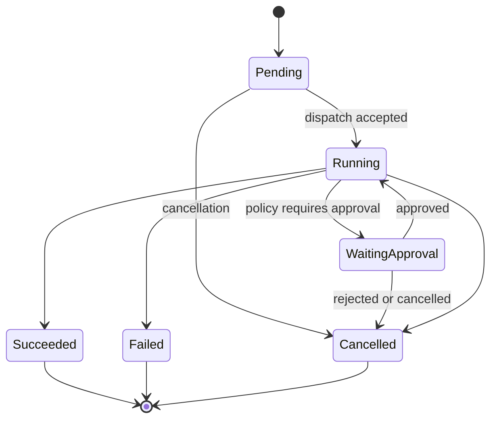
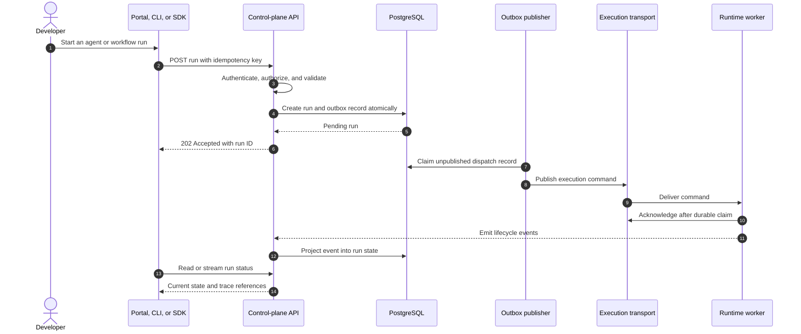
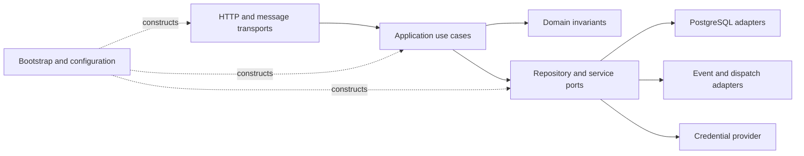

# Control Plane

## Status

Target architecture for v0.2 and later. The current Go module contains only
initial package metadata.

## Responsibilities

The control plane is the authoritative management API for Corex AgentOS. It
owns:

- projects and project-scoped access;
- agent definitions and immutable agent versions;
- workflow definitions and immutable workflow versions;
- model, tool, MCP server, and credential metadata;
- run creation, scheduling, cancellation, and status;
- policy evaluation and human approval records;
- execution event ingestion and usage projections;
- versioned public APIs consumed by the portal, CLI, and SDKs.

It does not execute model/tool loops, store raw secrets in API payloads, or
embed provider-specific behavior into domain objects.

## Internal structure

The Go application follows strong module boundaries inside a single deployable
control plane before services are extracted:

```text
transport -> application -> domain
                    |
                    v
               repository
```

- **Domain** defines entities, invariants, value objects, and domain errors.
- **Application** coordinates use cases and transaction boundaries.
- **Repository** ports describe persistence without exposing SQL to the domain.
- **Transport** maps HTTP or asynchronous messages to application commands.
- **Bootstrap** constructs dependencies and starts process entry points.

Cross-domain imports should use narrow public interfaces or events. Domain
packages must not depend on HTTP frameworks, database drivers, or runtime
provider SDKs.

## API model

Public endpoints are versioned under `/api/v1`. Initial resources include
projects, agents, models, tools, runs, and events. APIs should provide:

- consistent resource identifiers and timestamps;
- structured errors with stable machine-readable codes;
- pagination and explicit filters for collection endpoints;
- idempotency keys for retryable create/action requests;
- optimistic concurrency or preconditions for mutable definitions;
- immutable version resources once published.

Transport models are separate from domain models. This prevents database or
internal refactors from becoming accidental API changes.

## Persistence

PostgreSQL becomes the durable source of truth in v0.2. A transaction should
atomically update domain state and append an outbox record when an asynchronous
event must follow. An outbox publisher then delivers the record without relying
on an unsafe database/message-broker dual write.

Repository rules:

- all rows are scoped to a project where applicable;
- schema changes use forward-compatible migrations;
- credentials store references to encrypted secret material, not plaintext;
- execution events are append-oriented;
- derived status and usage views can be rebuilt from durable records.

## Run lifecycle



State transitions are validated centrally and made idempotent. A duplicated
worker event must not advance a run twice or duplicate usage charges.

### Run creation and dispatch sequence



## Dispatch and scheduling

Early releases may dispatch in-process or to a directly managed runtime. The
application interface must remain transport-neutral so v0.6 can introduce NATS
JetStream without changing domain semantics.

The scheduler resolves due schedules, creates idempotent runs, and hands them
to the same dispatch path as manual runs. It must tolerate leader restarts and
duplicate wakeups.

### Control-plane component flow



## Scaling and failure handling

API instances are designed to be stateless apart from external dependencies.
Horizontal scaling therefore requires shared PostgreSQL state and coordinated
background workers. A failed dispatch is retried from durable state; a failed
request must never leave an untracked execution running.

Readiness should reflect whether an instance can serve its responsibility, not
merely whether its process is alive. Dependency degradation must appear in
health signals and structured logs.

## Security boundaries

Authentication establishes a principal; authorization checks the action,
project, and resource before application logic runs. Runtime work receives a
short-lived, least-privilege execution context rather than the caller's full
credential set. See [Security Model](security-model.md).

## Related decisions

- [ADR-0001: Go control plane](../adr/0001-go-control-plane.md)
- [ADR-0003: NATS JetStream](../adr/0003-nats-jetstream.md)
- [Event Model](event-model.md)
