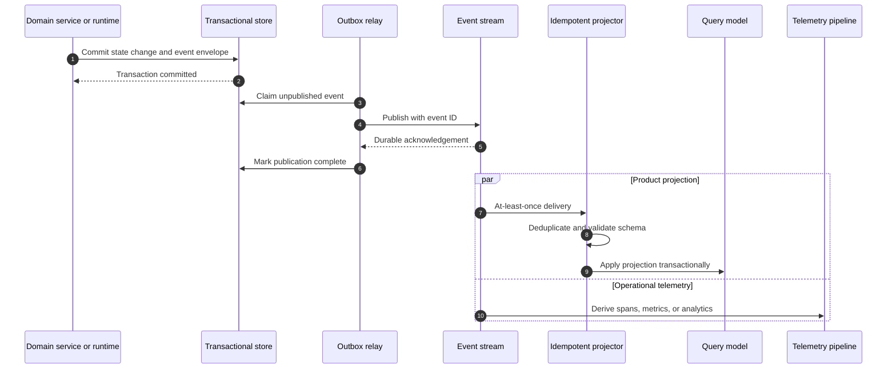
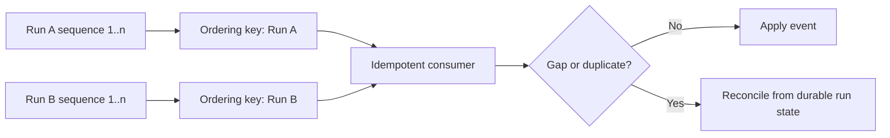

# Event Model

## Status

The initial lifecycle event set begins in v0.1. Durable distribution and the
full public contract evolve in later releases.

## Goals

Events provide an append-oriented record of important execution activity. They
support run inspection, projections, observability, auditing, and distributed
coordination without exposing language-specific objects.

Events are facts written in past tense. Commands such as “execute this node”
use separate message contracts even if they share a transport.

## Envelope

Every event uses a versioned envelope independent of its payload:

```json
{
  "id": "evt_01...",
  "type": "model.completed",
  "schema_version": 1,
  "occurred_at": "2026-08-09T10:15:30.123Z",
  "project_id": "prj_01...",
  "run_id": "run_01...",
  "workflow_run_id": null,
  "node_run_id": null,
  "agent_run_id": "arun_01...",
  "attempt_id": "attempt_01...",
  "sequence": 7,
  "trace_id": "4bf92f3577b34da6a3ce929d0e0e4736",
  "correlation_id": "run_01...",
  "causation_id": "evt_01...",
  "producer": "agent-runtime",
  "payload": {}
}
```

Identifiers are opaque. Timestamps use UTC and sufficient precision for
ordering diagnostics, but consumers must not use wall-clock time as a strict
global sequence.

## Initial taxonomy

v0.1 begins with:

- `run.started`, `run.completed`, and `run.failed`;
- `agent.started` and `agent.completed`;
- `model.requested` and `model.completed`;
- `tool.requested` and `tool.completed`.

Later releases add workflow/node, retry, approval, policy, evaluation,
retrieval, scheduling, and worker lifecycle events. New names use the
`noun.past_tense_verb` convention and must represent a meaningful state change
or operational fact.

## Payload design

Payloads contain typed fields specific to the event. Common identifiers remain
in the envelope so infrastructure can route and filter without parsing every
payload. Payloads should contain references for large artifacts and redacted
summaries for sensitive inputs.

Completion events include outcome metadata even when detailed content is
stored elsewhere. Failure payloads use stable error categories and safe
messages rather than serialized exception objects.

## Delivery semantics

Consumers assume at-least-once delivery. Every handler is idempotent by event
ID or a domain-specific idempotency key. Delivery order is guaranteed only
within the explicitly documented subject/stream key; consumers must tolerate
delayed or duplicated events.

The authoritative service writes state and an outbox entry in one database
transaction. Publishing from the outbox avoids loss between a database commit
and broker publication.

### Event publication and projection flow



### Ordering scope



## Sequence and terminal outcomes

The producer assigns a monotonically increasing sequence within a run or node
attempt where practical. A consumer may buffer short gaps but must be able to
reconcile from the durable API. Exactly one terminal outcome is accepted for a
given execution attempt.

## Schema evolution

- Existing fields do not change meaning within a schema version.
- Additive optional fields are preferred.
- Required or semantic changes increment `schema_version`.
- Consumers ignore unknown optional fields and reject unsupported required
  versions explicitly.
- Event fixtures and compatibility tests accompany contract changes.

Public event schemas will live under `schemas/` or `proto/events/` once the
contract format is selected.

## Retention and privacy

Event retention is configurable by event class and operational need. Secrets,
authorization headers, raw credentials, and unrestricted model/tool payloads
must never enter the event stream. Projects may opt into controlled content
capture with documented retention and redaction behavior.

Audit records have separate immutability and retention requirements even when
they originate from the same action.

## Transport independence

In-process v0.1 emitters and later NATS JetStream publishers implement the same
logical event contract. Domain code depends on an event publisher interface,
not NATS subjects or client types.

## Related documents

- [Observability](observability.md)
- [Control Plane](control-plane.md)
- [ADR-0003: NATS JetStream](../adr/0003-nats-jetstream.md)
