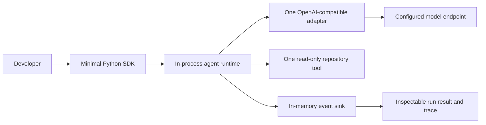
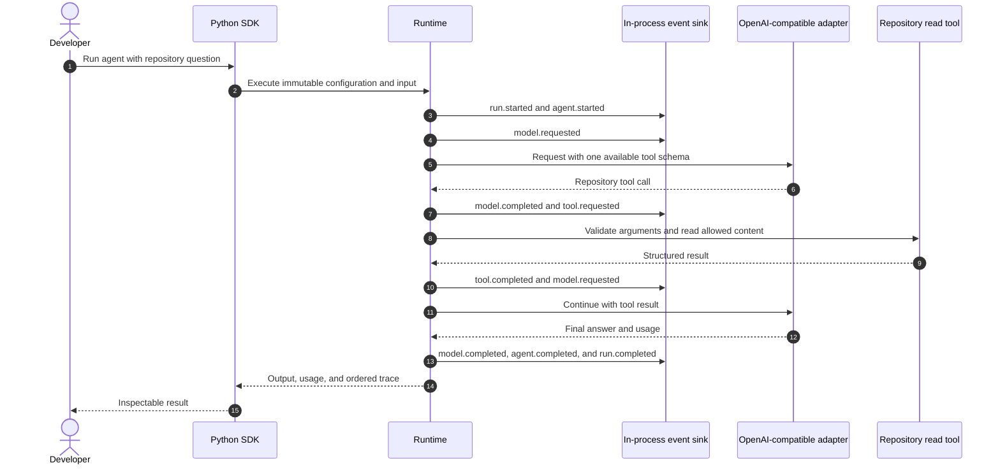
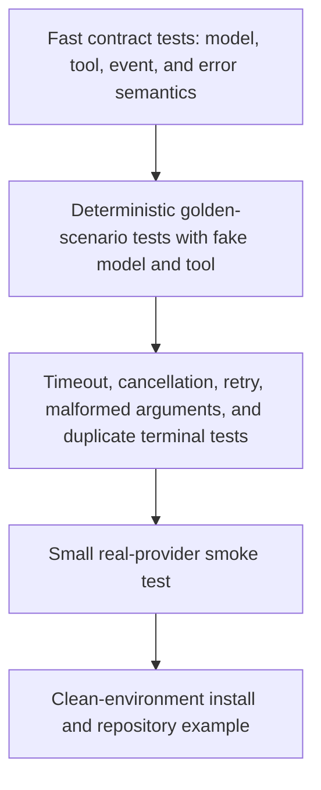
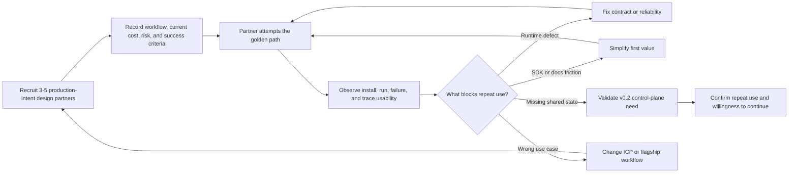

# Architecture Delivery Path

## Purpose

This document aligns the target architecture with the executable roadmap. It
prevents the platform diagram from becoming a mandate to build every service,
database, queue, portal screen, and enterprise control before Corex can execute
one useful agent reliably.

The governing sequence is:

> One provider, one tool, one complete trace, reliability, repeat external use,
> then the smallest control plane and workflow needed by that same use case.

## Architecture and roadmap contract

- [ROADMAP.md](../../ROADMAP.md) owns release order and evidence gates.
- [Architecture Overview](overview.md) owns target component boundaries.
- [Platform Planes](platform-planes.md) owns long-term responsibilities and
  cross-plane contracts.
- This document owns when each boundary becomes code, a process, or external
  infrastructure.

If the documents conflict, choose the smaller working vertical slice and open a
proposal before expanding scope.

## v0.1.0 golden vertical slice



Only seven runtime components are required:

1. A public `Agent` API.
2. An immutable execution context with IDs, deadline, and limits.
3. A provider-neutral model request/response interface.
4. One OpenAI-compatible adapter.
5. A provider-neutral tool interface with JSON Schema arguments.
6. One safe repository-reading tool.
7. An event sink that produces one complete run trace.

The first implementation can keep state in memory. Interfaces should permit
later persistence, but no repository layer should be invented without a real
consumer.

## Golden-path interaction



The same scenario must have deterministic fake-model and fake-tool tests. A
real provider smoke test supplements those tests but must not be the only proof.

## What must not block v0.1.0

- Go control-plane APIs.
- PostgreSQL migrations or repositories.
- NATS, Redis, or distributed workers.
- Portal integration.
- User authentication, RBAC, or external identity providers.
- General workflow DAGs or schedules.
- MCP client/server lifecycle.
- Persistent memory, RAG, embeddings, or vector stores.
- Anthropic and Ollama adapters.
- Model fallback.
- Kubernetes, Helm, GitOps reconciliation, or multi-environment deployment.
- Plugin marketplaces, enterprise organization management, or compliance
  exports.

These are deferred, not rejected. Each has a roadmap gate.

## v0.1 evolution without a rewrite

### v0.1.1 reliability

Keep the same golden-path API while adding:

- structured input and output validation;
- streaming with cancellation propagation;
- model, tool, and overall execution deadlines;
- normalized safe errors and retryability categories;
- bounded backoff for safe transient operations;
- token, cost, tool-call, runtime, and iteration limits;
- trace-completeness assertions for success, failure, timeout, and cancellation.

### v0.1.2 portability

Use the existing contracts to add breadth one adapter at a time:

1. Freeze provider contract tests against the golden adapter.
2. Add Anthropic and require the same contract suite.
3. Add Ollama only after local-model differences are explicitly normalized.
4. Add fallback only after two adapters prove compatible behavior.
5. Add tools only when a design-partner use case or missing contract requires
   them.

Portability is proven by interchangeable adapters, not by empty provider
directories.

## Plane activation matrix

| Plane | First active form | Activation gate | External infrastructure introduced |
| --- | --- | --- | --- |
| Experience | Minimal Python SDK and CLI/example output | Repository initializes | Portal/API integration in v0.2 |
| API and edge | None in v0.1 | Repeat team use needs remote/shared access | Go REST API in v0.2 |
| Authentication and identity | Local environment credentials only | Shared project access exists | Local users/API keys in v0.2; enterprise identity later |
| Control | In-memory execution configuration | Design partners need versions and durable history | Go control plane plus PostgreSQL in v0.2 |
| Security and governance | Local tool allowlist and safe read-only default | Sensitive actions or multi-user projects exist | Policy/approval services in v0.5 |
| Workflow | One hard-coded example interaction | A real multi-step use case exceeds one reliable agent | Durable workflow engine in v0.3 |
| Execution | One in-process Python runtime | Initialization complete | Worker pools and broker delivery in v0.6 |
| Integration | One model adapter and one local tool | Golden path requires them | MCP and knowledge integrations in v0.4 |
| Data | In-memory run state and ordered event list | Team needs shared durable state | PostgreSQL v0.2; vector v0.4; NATS/Redis v0.6 |
| Observability and evaluation | Structured v0.1 events in the run result | First execution exists | OpenTelemetry/AgentOps v0.7; evaluation v0.5 |
| GitOps and delivery | Basic CI for tests and package build | Deployable components and environments exist | Production reconciliation and rollout hardening v0.9-v1.0 |

## Release slices

| Slice | User-visible outcome | Architecture activated | Explicit exclusion |
| --- | --- | --- | --- |
| v0.1.0 | Run one repository-analysis agent and inspect its trace | SDK, in-process runtime, one model, one tool, events | No server or distributed infrastructure |
| v0.1.1 | Trust timeout, cancellation, limits, errors, and trace completeness | Runtime reliability contracts | No provider breadth for its own sake |
| v0.1.2 | Swap proven providers without changing agent code | Provider adapters and contract tests | No fallback until compatibility exists |
| v0.2 | Share immutable agents and durable run history with a small team | API, identity foundation, Go control plane, PostgreSQL, minimal portal | No general workflow builder |
| v0.3 | Execute and recover the flagship multi-step workflow | Workflow definition, node state, scheduler, retry/resume | No broad integration marketplace |
| v0.4 | Use one validated MCP server and knowledge source | MCP, ingestion, retrieval, pgvector | No unsupported storage matrix |
| v0.5 | Govern one sensitive action and gate one candidate release | Policy, approval, budgets, evaluation | No speculative compliance suite |
| v0.6 | Survive worker loss at measured concurrency | NATS, workers, backpressure, selective Redis | No distributed system before measured need |
| v0.7-v1.0 | Diagnose, extend, harden, deploy, upgrade, and recover production | AgentOps, stable contracts, GitOps, Kubernetes | No post-v1 enterprise breadth |

## v0.1 code boundaries

The implementation should begin with cohesive modules, not the complete target
folder tree:

```text
apps/agent-runtime/src/corex_runtime/
  agent.py          public agent definition and run entry point
  context.py        immutable execution context and limits
  models.py         provider-neutral protocol and normalized types
  providers/
    openai.py       first real adapter
  tools.py          tool protocol, schema validation, and registry
  events.py         event envelope, event sink, and trace assembly
  errors.py         normalized runtime errors

packages/sdk-python/src/corex/
  __init__.py       minimal supported public API

examples/
  repository-analyzer/
```

Names may change during implementation, but each file must serve the golden
slice. Do not pre-create every future domain package merely to match the target
architecture diagram.

## Minimal contracts to stabilize

### Agent contract

- immutable name, instructions, model reference, tools, and limits;
- typed input and result;
- explicit synchronous entry point first, with async/streaming added when
  implemented correctly;
- no dependency on control-plane resource types.

### Model contract

- normalized messages and tool declarations;
- response content, tool calls, finish reason, and usage;
- deadline/cancellation input;
- normalized error with safe message and retryability.

### Tool contract

- stable name and description;
- JSON Schema input;
- side-effect class, timeout, and required local permission;
- normalized success or failure result.

### Event contract

- stable event ID, type, timestamp, run/agent correlation, sequence, and payload;
- exactly one accepted terminal run outcome;
- ordered in-process collection for v0.1;
- transport-neutral emitter so persistence and NATS can be added later.

## Test architecture



Every defect in the golden path should first become a deterministic regression
test. External provider tests are bounded and separately marked because network
or account failures do not necessarily indicate a runtime regression.

## Design-partner evidence loop



Design-partner count is not traction by itself. Required evidence is repeated
use, an explicit production-intent workflow, observed failure modes, and a
clear reason the next architecture slice is necessary.

## Expansion decision rules

Add a new provider when:

- an active use case requires it;
- it passes the provider contract suite;
- differences are normalized without leaking provider types into core code.

Add a new tool or MCP integration when:

- it enables a validated workflow;
- permissions, side effects, timeouts, retries, and trace content are defined;
- it has an owner and compatibility tests.

Add a service or stateful dependency when:

- an in-process module cannot meet a measured reliability, scale, security, or
  ownership requirement;
- its source-of-truth and failure behavior are documented;
- local development remains simple;
- the deployment and recovery burden is accepted.

## Architecture acceptance gates

### Before v0.2

- Clean install to first traced run is documented and tested.
- Success, provider failure, tool failure, timeout, and cancellation produce
  complete terminal traces.
- Model and tool contracts have deterministic tests.
- No control-plane dependency exists in the local SDK path.
- 3-5 design partners have attempted real workflows and generated repeat-use
  evidence or clearly classified blockers.

### Before v0.3

- The Go control plane calls the same runtime contract used locally.
- Agent versions and run history are durable and immutable where required.
- Authentication and project boundaries are tested.
- A specific multi-step customer workflow justifies durable orchestration.

### Before distributed infrastructure

- Single-process capacity and failure limits are measured.
- Task identity, idempotency, retry, and terminal-event rules are already stable.
- Worker failure tests demonstrate a reason for broker-backed redelivery.
- The team can operate and recover PostgreSQL before adding NATS and Redis.

## Architecture review checklist

For every proposal, ask:

1. Which current user workflow fails without this change?
2. What observed evidence supports it?
3. Can the need be met inside an existing module?
4. Does it preserve the golden local path?
5. Which contract changes, and how is compatibility tested?
6. What new state, secret, network, or failure boundary appears?
7. How is the change traced, secured, upgraded, and recovered?
8. What work is explicitly deferred?
9. What measurable exit condition proves the change useful?

If these questions do not have concrete answers, keep the item in the target
architecture rather than implementing it now.

## Related documents

- [Roadmap](../../ROADMAP.md)
- [Architecture Overview](overview.md)
- [Platform Planes and Modules](platform-planes.md)
- [Agent Runtime](runtime.md)
- [Control Plane](control-plane.md)
