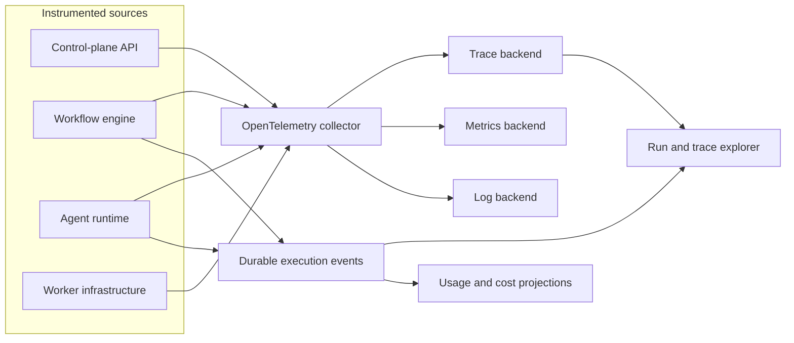
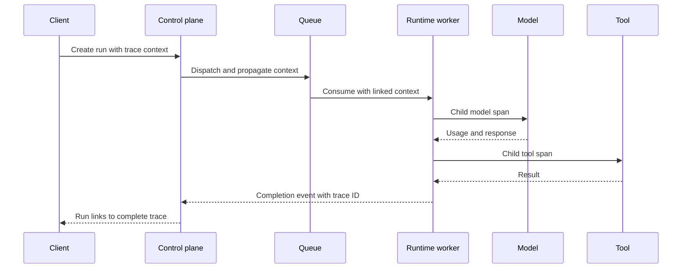

# Observability

## Status

Structured execution events begin in v0.1. OpenTelemetry-based distributed
tracing and the full AgentOps experience mature in v0.7.

## Objectives

Operators and developers must be able to answer:

- what an agent or workflow did and why;
- which models, tools, and knowledge sources were used;
- where time, tokens, and money were spent;
- which retry, policy, and approval decisions affected the outcome;
- whether a failure came from platform code or an external dependency;
- whether a new version improved quality, reliability, or cost.

## Signals

Corex uses four related signals:

- **Execution events** are durable product facts used for run history.
- **Traces** describe causal timing across services and operations.
- **Metrics** aggregate health, throughput, latency, errors, tokens, and cost.
- **Logs** explain local operational details that do not belong in contracts.

No single signal replaces the others. Event storage is not a high-cardinality
metrics backend, and logs are not the authoritative run record.

### Telemetry pipeline



## Trace model

```text
Workflow run
└── Node attempt
    └── Agent execution
        ├── Model request
        ├── Tool invocation
        ├── Retrieval operation
        └── Policy or approval operation
```

Local agent runs use the agent execution as the root span. Retries create
distinct attempt spans linked to the logical operation. Asynchronous dispatch
propagates trace context in message headers and records producer/consumer links
where a direct parent-child relationship would be misleading.



## Correlation

Run, workflow run, node run, agent run, attempt, trace, and project identifiers
use consistent field names across events, spans, and logs. User interfaces can
navigate from a run to its trace without searching text logs.

High-cardinality identifiers are span/log attributes, not unbounded metric
labels.

## Metrics

Initial metrics include:

- run and node counts by outcome;
- model and tool request duration and failure counts;
- token usage and estimated model cost;
- active executions, queue depth, and wait time;
- retry, timeout, cancellation, and approval counts;
- API latency, error rate, and dependency health.

Metric labels use bounded dimensions such as operation, provider, model family,
outcome, and deployment. Project-level views should be derived carefully to
avoid unbounded infrastructure metrics.

## Structured logging

Logs are machine-readable and include timestamp, severity, service, operation,
correlation identifiers, and a stable message or error code. Production code
does not print raw request bodies, prompts, tool arguments, credentials, or
retrieved documents by default.

Errors retain internal diagnostic context while public APIs and events expose
safe messages.

## Tokens and cost

Provider-reported usage is retained with the provider, model, pricing version,
currency, and estimation status. Estimated cost is not represented as exact
billing. Missing usage is explicit rather than silently treated as zero.

Aggregations support per-run, workflow, agent, model, and project analysis.

## Content capture and privacy

Metadata collection is on by default; content capture is controlled. Operators
can configure whether prompts, completions, tool arguments/results, and
retrieved chunks are omitted, redacted, sampled, or retained. Secret detection
and field-level redaction run before export.

Telemetry exporters must not weaken project isolation. Retention and access
controls are documented for each backend.

## Instrumentation rules

- Instrument boundaries, not every helper function.
- Use semantic, stable operation names.
- Record outcomes on spans and events exactly once.
- Preserve the original error category across service boundaries.
- Keep exporters replaceable and avoid backend-specific calls in domain code.
- Test trace propagation and redaction as contracts.

## Operational targets

Formal service-level objectives are introduced after representative workloads
exist. Before then, releases establish baselines for API availability, dispatch
delay, execution success, trace completeness, and telemetry export loss.

Observability failure must not corrupt run state. Export paths use bounded
queues and visible drop counters so telemetry backpressure cannot exhaust the
runtime.

## Related documents

- [Event Model](event-model.md)
- [Agent Runtime](runtime.md)
- [Workflow Engine](workflow-engine.md)
- [Security Model](security-model.md)
