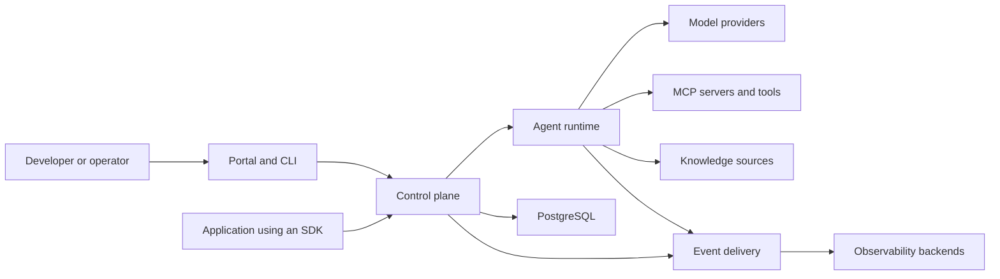

# Architecture Overview

## Status

Target architecture. The repository is currently in its initialization phase;
implementation proceeds incrementally according to the
[roadmap](../../ROADMAP.md).

## Purpose

Corex AgentOS is an operational layer for defining, executing, governing,
observing, and evaluating AI agents. It separates management concerns from the
code that performs model and tool execution so each can evolve independently.

The architecture optimizes for:

- provider-independent agent and model contracts;
- reliable, inspectable execution;
- explicit permissions and human approval;
- immutable definitions for reproducible runs;
- local development before distributed infrastructure;
- self-hosting with portable, open interfaces.

## System context

## Major components

### Control plane

The Go control plane owns resource APIs and durable management state. It
validates agent and workflow definitions, resolves immutable versions,
dispatches execution work, enforces control-plane authorization, and exposes
run state to clients. See [Control Plane](control-plane.md).

### Agent runtime

The Python runtime executes agents. It owns the model/tool loop, runtime
timeouts and cancellation, provider adapters, tool invocation, and detailed
execution telemetry. It does not own durable project configuration. See
[Agent Runtime](runtime.md).

### Workflow engine

The workflow engine coordinates versioned directed acyclic graphs of agent,
tool, conditional, and approval nodes. The control plane owns durable workflow
state; workers perform node execution. See
[Workflow Engine](workflow-engine.md).

### Portal, CLI, and SDKs

Clients consume versioned public APIs. They must not connect directly to
control-plane databases or rely on internal event subjects. Shared clients live
under `packages/`; deployable applications live under `apps/`.

### External systems

Model providers, MCP servers, data sources, and observability backends are
outside the platform trust boundary. Adapters translate their behavior into
stable Corex contracts and normalize errors, usage, and telemetry.

## Control and data flow

A typical run follows this sequence:

1. A client submits a run against an immutable agent or workflow version.
2. The control plane authenticates the caller, checks project scope, validates
   the request, and creates the durable run record.
3. Execution is dispatched locally in early releases and through NATS
   JetStream when distributed workers are introduced.
4. A runtime worker executes model and tool operations while emitting
   structured events and telemetry.
5. The control plane projects events into queryable run state and usage data.
6. Clients observe progress through APIs and inspect the complete trace after
   completion.

Sensitive actions add a policy decision and, when required, a durable approval
pause before execution continues.

## Source-of-truth rules

- PostgreSQL is the durable source of truth for platform resources and run
  state once persistence is introduced.
- NATS JetStream carries distributed work and events; it is not the canonical
  resource database.
- Redis may support ephemeral coordination, caching, and rate limits; it must
  not own durable platform state.
- Tracing backends provide operational views but do not replace durable run
  records.
- Every run references immutable agent and workflow versions.

## Contract boundaries

Public REST APIs, workflow and policy schemas, SDK interfaces, and the event
envelope are versioned contracts. Internal packages may evolve more quickly but
must not leak into public clients. Go/Python communication uses explicit
schemas rather than language-specific object serialization.

See [Event Model](event-model.md) for asynchronous contracts and
[ADR-0004](../adr/0004-mcp-first-tools.md) for external tool integration.

## Deployment evolution

The architecture expands only when a release requires it:

- v0.1 runs a Python agent locally and captures a complete trace.
- v0.2 adds the Go control plane, PostgreSQL, and portal-backed management.
- v0.3 adds durable workflows.
- v0.4 makes MCP and knowledge sources first-class.
- v0.5 adds policies, approvals, budgets, and evaluations.
- v0.6 introduces NATS JetStream and distributed workers.
- v1.0 packages the production system for self-hosted Kubernetes operation.

This sequence is intentional: module boundaries are established early, while
network boundaries are introduced only when scale or reliability demands them.

## Related documents

- [Control Plane](control-plane.md)
- [Agent Runtime](runtime.md)
- [Workflow Engine](workflow-engine.md)
- [Security Model](security-model.md)
- [Observability](observability.md)
