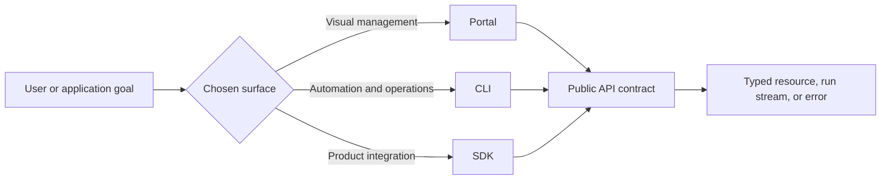
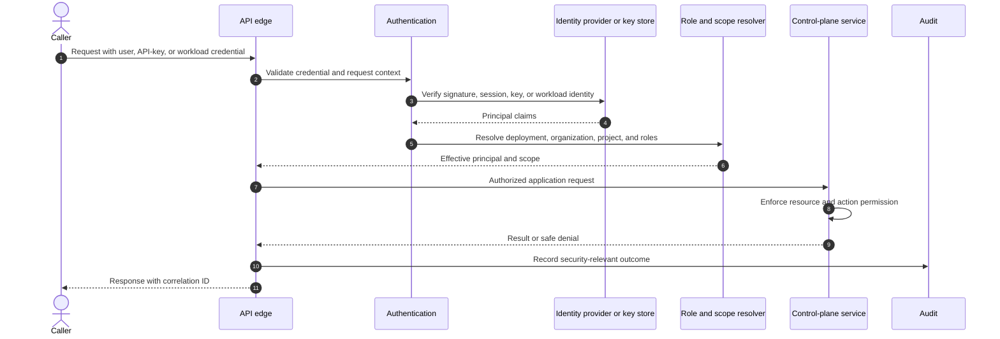
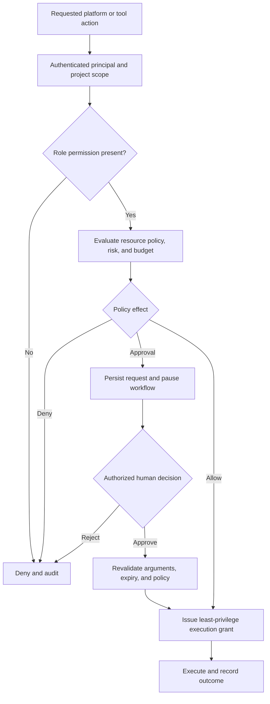
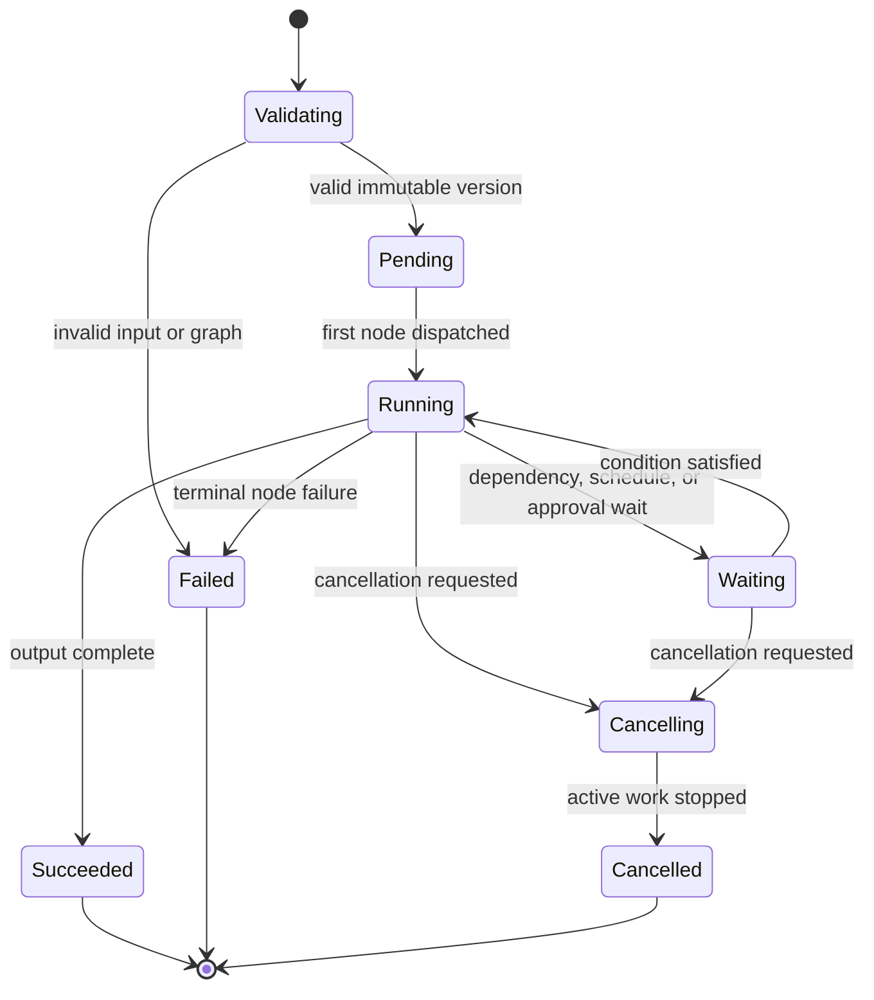
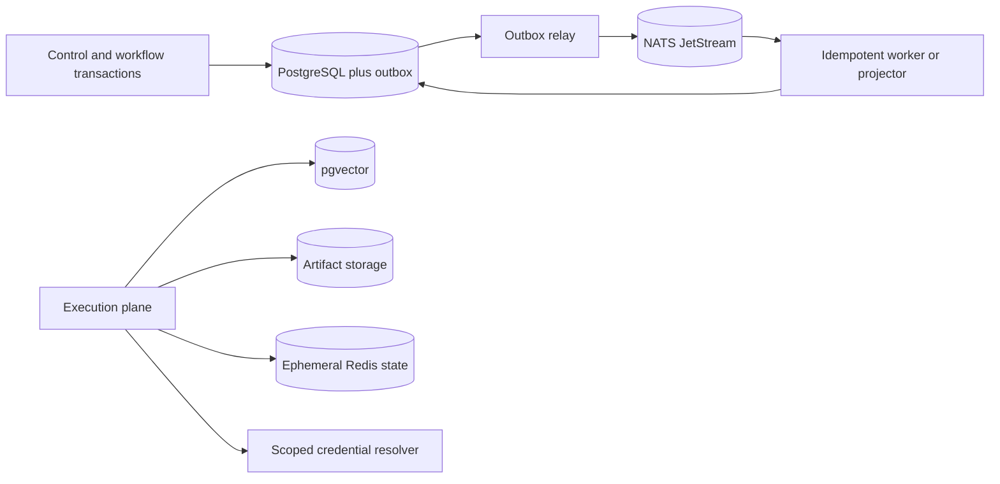
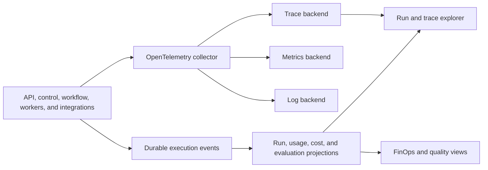
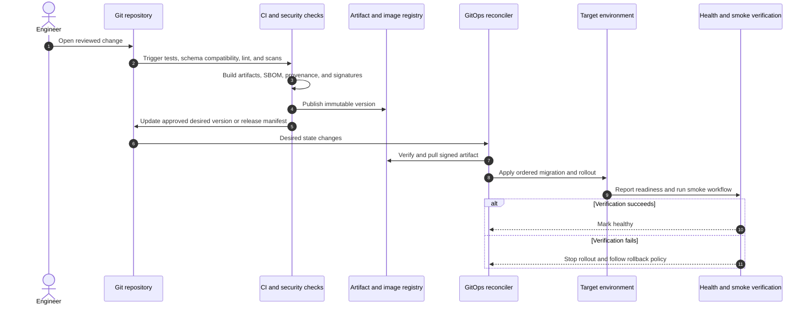
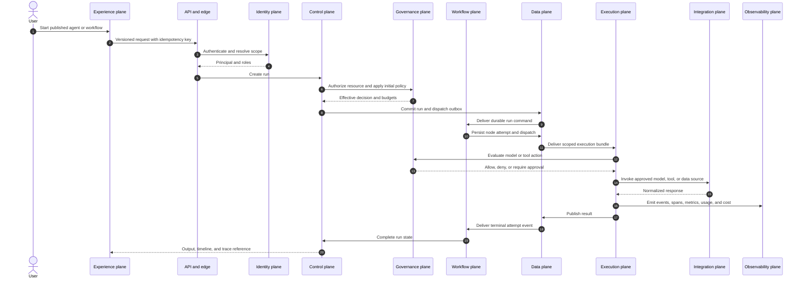

# Platform Planes and Modules

## Status and interpretation

This document defines the target logical planes of Corex AgentOS. A plane is an
ownership and contract boundary, not necessarily a separately deployed
microservice. The platform begins as strongly bounded modules and separates
processes only when scale, security, reliability, or ownership requires it.

The repository is currently in initialization and v0.1 foundation development.
Most planes described here are planned capabilities from the
[roadmap](../../ROADMAP.md).

## Complete plane model

```mermaid
flowchart TB
    Actors["Developers, operators, approvers, auditors, applications, and partners"]

    subgraph Experience["1. Experience plane"]
        Portal["Portal"]
        CLI["CLI"]
        SDKs["SDKs and client libraries"]
    end

    subgraph Edge["2. API and edge plane"]
        REST["Versioned REST API"]
        Stream["Run streams"]
        Hooks["Signed webhooks"]
        Validate["Request validation, limits, and idempotency"]
    end

    subgraph Identity["3. Authentication and identity plane"]
        IdentityProviders["Local identity, API keys, OIDC, and SSO"]
        Sessions["Sessions and token validation"]
        Workload["Service and workload identity"]
        RBAC["Role and project-scope resolution"]
    end

    subgraph Control["4. Control plane"]
        Projects["Projects and membership"]
        Catalog["Agent, model, tool, and credential catalog"]
        Versions["Immutable resource versions"]
        Runs["Run lifecycle and public state"]
    end

    subgraph Security["5. Security and governance plane"]
        Policy["Policy evaluation"]
        Approval["Human approval"]
        Budget["Budgets and guardrails"]
        Audit["Audit and retention"]
        SecretBroker["Credential brokering"]
    end

    subgraph Workflow["6. Workflow plane"]
        Spec["Workflow schema and compiler"]
        DAG["DAG and node state"]
        Scheduler["Manual and scheduled triggers"]
        Recovery["Retry, pause, resume, and recovery"]
        Dispatch["Node dispatch"]
    end

    subgraph Execution["7. Execution plane"]
        Workers["Worker registry and pools"]
        Runtime["Python agent runtime"]
        ModelRouter["Model routing and fallback"]
        ToolRuntime["Tool and MCP execution"]
        Retrieval["Retrieval and memory"]
    end

    subgraph Integration["8. Integration plane"]
        Models["Model providers"]
        MCP["MCP servers"]
        Sources["Knowledge and business systems"]
        IdentityIntegration["External identity providers"]
        Exporters["Telemetry and delivery integrations"]
    end

    subgraph Data["9. Data plane"]
        Postgres[("PostgreSQL")]
        Vector[("pgvector and vector adapters")]
        NATS[("NATS JetStream")]
        Redis[("Redis")]
        Secrets[("Encrypted secrets")]
        Objects[("Artifacts and object storage")]
    end

    subgraph Observe["10. Observability and evaluation plane"]
        Events["Execution event model"]
        OTel["OpenTelemetry collector"]
        Signals["Traces, metrics, and logs"]
        Explorer["Run and trace explorer"]
        Cost["Tokens, usage, and cost"]
        Evals["Evaluation and regression"]
    end

    subgraph GitOps["11. GitOps and delivery plane"]
        Git["Source and declarative configuration"]
        CI["Test, lint, scan, and contract validation"]
        Build["Build, SBOM, signing, and registries"]
        Reconciler["Environment reconciler"]
        Migration["Migration, rollout, and rollback"]
    end

    Actors --> Experience
    Experience --> Edge
    Edge --> Identity
    Identity --> Control
    Identity --> Security
    Control --> Workflow
    Security --> Workflow
    Workflow --> Execution
    Execution --> Integration
    Control --> Data
    Security --> Data
    Workflow --> Data
    Execution --> Data
    Control --> Observe
    Security --> Observe
    Workflow --> Observe
    Execution --> Observe
    GitOps -.->|deploys and configures| Experience
    GitOps -.->|deploys and configures| Edge
    GitOps -.->|deploys and configures| Identity
    GitOps -.->|deploys and configures| Control
    GitOps -.->|deploys and configures| Security
    GitOps -.->|deploys and configures| Workflow
    GitOps -.->|deploys and configures| Execution
    GitOps -.->|deploys and configures| Observe
```

## Plane responsibility matrix

| Plane | Owns | Does not own | Primary consumers |
| --- | --- | --- | --- |
| Experience | Human and application interaction surfaces | Business invariants or direct database access | Developers, operators, applications |
| API and edge | Public transport, request validation, limits, idempotency, webhooks | Durable domain state | Portal, CLI, SDKs, external applications |
| Authentication and identity | Principal authentication, sessions, API keys, service identity, role resolution | Agent tool authorization by itself | API, control, security, workers |
| Control | Projects, catalogs, immutable versions, public run lifecycle | Model/tool execution loops | Experience, workflow, operations |
| Security and governance | Policy, approvals, budgets, guardrails, credential grants, audit | User-interface rendering or provider behavior | Control, workflow, execution, auditors |
| Workflow | DAG validation, scheduling, node state, dispatch, retry, pause, resume | Provider-specific execution | Control, workers, portal |
| Execution | Agent loop, model/tool calls, cancellation, runtime errors, worker capabilities | Durable project administration | Workflow, applications, observability |
| Integration | Adapters for external models, tools, data, identity, and exporters | Core platform policy or durable state | Execution, identity, observability |
| Data | Durable records, streams, vector data, cache, secrets, artifacts | Business decisions | All stateful planes |
| Observability and evaluation | Events, traces, metrics, logs, usage, cost, evaluations | Authoritative resource mutation | Developers, SRE, security, FinOps |
| GitOps and delivery | Versioned configuration, validation, artifacts, deployment reconciliation | Runtime business decisions | Platform engineers and release automation |

## 1. Experience plane

The experience plane translates platform capabilities into task-focused
interfaces. It contains:

- the React developer portal;
- the Go CLI;
- Python, Go, and TypeScript SDKs;
- generated API clients and workflow examples;
- role-aware navigation and safe content presentation.

It consumes public APIs only. It never connects directly to PostgreSQL, NATS,
Redis, worker internals, or secret stores.

## 2. API and edge plane

The edge plane provides the stable entry boundary:

- `/api/v1` REST resources;
- pagination, filtering, structured errors, and request validation;
- idempotency and concurrency preconditions;
- streaming run updates where supported;
- signed outbound webhooks;
- rate, payload-size, and timeout enforcement;
- correlation and trace-context propagation.

Transport DTOs remain separate from domain and persistence models.

## 3. Authentication and identity plane

The identity plane establishes who or what is calling and which scope applies.
It supports progressively:

- local users and project API keys;
- application service accounts;
- runtime worker and internal service identities;
- external OIDC identity providers;
- enterprise SSO and organization identity beyond the initial v1 scope.

Authentication does not by itself authorize an agent tool call. It produces a
principal and role context consumed by authorization and policy decisions.

## 4. Control plane

The Go control plane is the durable management authority for:

- projects, membership, and resource ownership;
- agent, workflow, model, tool, MCP, credential, and evaluation metadata;
- mutable drafts and immutable published versions;
- run creation, cancellation, status, output references, and usage views;
- versioned public APIs used by all experience surfaces.

PostgreSQL is its source of truth. State changes that need asynchronous delivery
use a transactional outbox.

## 5. Security and governance plane

This cross-cutting plane converts identity and resource context into safe
execution authority. It includes:

- role and project authorization;
- allow, deny, and require-approval policies;
- exact-argument human approval;
- token, cost, tool-call, runtime, and iteration budgets;
- model input/output and tool boundary guardrails;
- just-in-time credential resolution;
- audit, retention, and security event recording.

## 6. Workflow plane

The workflow plane turns an immutable DAG into durable node attempts. It owns:

- schema validation and graph compilation;
- sequential, parallel, conditional, agent, tool, and approval nodes;
- manual and scheduled triggers;
- ready-node calculation and concurrency limits;
- retry, backoff, timeout, cancellation, and failure propagation;
- durable pause, approval wait, resume, and task recovery;
- immutable workflow version and attempt references.

## 7. Execution plane

The Python execution plane performs work dispatched by the workflow or run
coordinator. It contains:

- worker registration, heartbeats, capabilities, and draining;
- explicit execution context, cancellation, deadline, and budgets;
- provider-independent model routing, streaming, and fallback;
- tool registration, validation, permission checks, and invocation;
- MCP client lifecycle;
- retrieval, reranking, run memory, and later persistent-memory adapters;
- normalized runtime errors and execution telemetry.

Workers receive an immutable, scoped execution bundle and cannot administer
projects or unrelated runs.

## 8. Integration plane

The integration plane is the boundary to systems Corex does not own:

- model providers;
- MCP tool servers and business applications;
- documents, repositories, APIs, databases, and vector stores;
- external identity and secret providers;
- telemetry exporters, webhooks, and future marketplace integrations.

Adapters normalize schemas, errors, timeouts, usage, and telemetry. External
responses are treated as untrusted input. Integration availability never
overrides policy or permission.

## 9. Data plane

The data plane separates storage by responsibility:

| Component | Purpose | Source-of-truth rule |
| --- | --- | --- |
| PostgreSQL | Projects, definitions, versions, runs, events, approvals, usage | Durable platform source of truth |
| pgvector | Initial embeddings and vector retrieval | Durable knowledge index linked to source metadata |
| NATS JetStream | Distributed commands and events | Delivery substrate, not canonical resource state |
| Redis | Cache, rate limits, leases, and short-lived coordination | Reconstructable; never durable truth |
| Secret storage | Encrypted credentials and key references | Controlled by credential service and rotation policy |
| Artifact storage | Large outputs, datasets, exports, and trace-linked artifacts | Referenced from durable metadata |

## 10. Observability and evaluation plane

This plane makes agent behavior and platform operation inspectable:

- structured execution events;
- OpenTelemetry context propagation and collection;
- workflow, node, agent, model, tool, retrieval, policy, and approval spans;
- service metrics and structured logs;
- run timeline and trace explorer;
- tokens, estimated cost, latency, retries, and failure analytics;
- datasets, evaluators, scores, regression gates, and version comparisons;
- audit views with separate access and retention.

Telemetry failure cannot corrupt run state or block execution indefinitely.
Export paths are bounded and expose loss counters.

## 11. GitOps and delivery plane

The GitOps plane provides a versioned, reviewable path from source and desired
configuration to running environments. It is distinct from agent workflow
execution: GitOps manages the platform and approved declarative resources; the
workflow plane runs business or agent workflows.

### GitOps-managed inputs

- application and package source;
- API, event, policy, tool, and workflow schemas;
- deployment manifests, Helm values, and environment overlays;
- approved policy bundles and resource definitions where GitOps management is
  enabled;
- database migrations;
- dependency locks, SBOM policy, and release metadata;
- observability dashboards, alerts, and collector configuration.

### Delivery flow

### GitOps controls

- protected branches and required review;
- environment-specific authorization and separation of duties;
- schema and backward-compatibility validation;
- secret references rather than plaintext secrets in Git;
- immutable artifacts with provenance and SBOMs;
- ordered migration, canary/rolling deployment, and rollback procedures;
- drift detection and an auditable reconciliation history;
- break-glass changes that are time-limited and reconciled back to Git.

No specific GitOps controller is mandated initially. A later deployment ADR
should select the supported controller and promotion model.

## Cross-plane execution sequence

## Cross-plane contracts

| Producer | Consumer | Contract |
| --- | --- | --- |
| Experience | API and edge | OpenAPI request/response, streaming, webhook schema |
| API and edge | Identity | Credential, session, principal, and scope contract |
| Identity | Control and governance | Principal, roles, project scope, workload identity |
| Control | Workflow | Immutable run request and resolved resource versions |
| Governance | Workflow and execution | Policy decision, budget, approval, and scoped credential grant |
| Workflow | Execution | Versioned node execution bundle and attempt identity |
| Execution | Integration | Provider-neutral model, tool, MCP, and retrieval interfaces |
| Stateful planes | Data | Repository, outbox/inbox, stream, artifact, and secret interfaces |
| All planes | Observability | Event envelope, OpenTelemetry context, metric and log conventions |
| GitOps | Deployable planes | Signed artifacts, schemas, migrations, manifests, and desired state |

## Repository module mapping

| Plane | Primary repository areas |
| --- | --- |
| Experience | `apps/portal`, `apps/cli`, `packages/sdk-*`, `packages/api-client-ts`, `packages/ui` |
| API and edge | `apps/control-plane/internal/server`, `transport`, and middleware modules when created |
| Authentication and identity | `apps/control-plane/internal/auth` and credential modules when created |
| Control | `apps/control-plane/internal/project`, `agent`, `model`, `tool`, and execution modules |
| Security and governance | approval, policy, credential, audit, and guardrail modules |
| Workflow | control-plane workflow/scheduler modules and `packages/workflow-spec` |
| Execution | `apps/agent-runtime` runtime, agents, models, tools, workers, and memory modules |
| Integration | `integrations/` and runtime provider/MCP adapters |
| Data | control-plane persistence packages, `infrastructure/`, `schemas/`, and `proto/` |
| Observability and evaluation | tracing, telemetry, event, billing, evaluation, and portal explorer modules |
| GitOps and delivery | `.github/workflows`, `deploy/`, `scripts/`, release configuration, and environment overlays when created |

## Failure containment by plane

| Failure | Required containment behavior |
| --- | --- |
| Experience unavailable | APIs and active execution continue; users can use another client |
| Identity unavailable | New privileged requests fail closed; existing short-lived work follows expiry policy |
| Control instance fails | Another stateless replica serves requests; durable state remains authoritative |
| Workflow scheduler fails | Another scheduler reconciles durable ready state without duplicate effects |
| Worker fails | Unacknowledged work is redelivered and claimed idempotently |
| External model or tool fails | Bounded retry, allowed fallback, or normalized terminal failure |
| Redis fails | Rebuild ephemeral state; do not lose durable resources or runs |
| NATS is interrupted | Preserve outbox, pause delivery, and reconcile after recovery |
| Telemetry backend fails | Bound buffering, expose drops, and never corrupt run state |
| GitOps rollout fails | Stop promotion and apply tested rollback or forward-fix procedure |

## Roadmap activation

Plane activation is gated by evidence, not by the existence of a diagram. A
plane begins as an interface or in-process module where possible and becomes
external infrastructure only when its release needs the corresponding state,
scale, security, or reliability property.

```mermaid
flowchart LR
    Init["Initialization"] --> V01["v0.1: experience SDK, execution, model/tool, events"]
    V01 --> V02["v0.2: edge, identity foundation, control, PostgreSQL"]
    V02 --> V03["v0.3: workflow plane"]
    V03 --> V04["v0.4: integration, knowledge, and vector data"]
    V04 --> V05["v0.5: governance, approval, and evaluation"]
    V05 --> V06["v0.6: distributed data delivery and worker pools"]
    V06 --> V07["v0.7: complete observability and AgentOps"]
    V07 --> V08["v0.8: stable experience and extension contracts"]
    V08 --> V09["v0.9: security, reliability, and GitOps hardening"]
    V09 --> V10["v1.0: production self-hosted deployment"]
```

## Related documents

- [Architecture Overview](overview.md)
- [Architecture Delivery Path](implementation-path.md)
- [Detailed System Design](system-design.md)
- [Control Plane](control-plane.md)
- [Workflow Engine](workflow-engine.md)
- [Agent Runtime](runtime.md)
- [Security Model](security-model.md)
- [Observability](observability.md)
