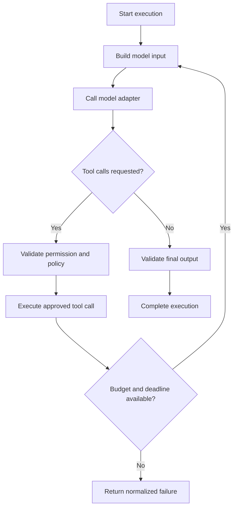

# Agent Runtime

## Status

Target architecture beginning in v0.1. The current Python package contains
only initialization metadata.

## Responsibilities

The Python agent runtime executes one agent or workflow node within an explicit
execution context. It owns:

- agent lifecycle and the model/tool interaction loop;
- provider-independent model requests and normalized responses;
- tool registration, argument validation, permission checks, and invocation;
- timeout, retry, cancellation, and error semantics;
- runtime event and telemetry emission;
- bounded run-scoped state required by the active execution.

The runtime does not own projects, published versions, schedules, durable
approvals, or user authentication. Those remain control-plane concerns.

## Execution context

Every execution receives an immutable context containing at least:

- run, project, agent version, and optional workflow/node identifiers;
- deadline and cancellation signal;
- model and tool configuration resolved for this run;
- scoped credential references and effective permissions;
- trace context and event emitter;
- token, cost, tool-call, and iteration budgets.

Ambient global configuration is avoided because it makes concurrent runs hard
to isolate, test, and replay.

## Agent loop

Each boundary emits structured lifecycle events. The loop has explicit maximum
iterations and cannot continue after cancellation, deadline expiry, or budget
exhaustion.

## Model abstraction

Provider adapters implement a common interface for messages, streaming,
structured output, tool calls, usage, and errors. Adapters translate provider
payloads at the edge. Core agent logic must not branch on an OpenAI, Anthropic,
or Ollama response type.

Fallback is policy-driven and observable. A fallback records both the failed
attempt and the selected replacement; it must respect output compatibility,
data residency, cost, and model permissions.

## Tool abstraction

A tool has a stable name, description, JSON Schema input, result contract,
side-effect classification, timeout, and required permissions. Invocation
validates arguments before any side effect occurs.

MCP tools and in-process tools share the same runtime-facing contract. Tool
results are treated as untrusted input before being returned to a model. See
[ADR-0004](../adr/0004-mcp-first-tools.md).

## Retries and errors

Retries apply only to failures classified as transient and operations known to
be safe or idempotent. Retry policy includes a maximum attempt count, bounded
backoff, jitter, and the remaining run deadline. Side-effecting tools are not
automatically retried without an idempotency mechanism.

Runtime errors carry a stable category, retryability, safe public message,
internal cause, and operation metadata. Secrets and full model inputs are not
placed in public error messages.

## Cancellation

Cancellation is cooperative and propagates through model streams, tool calls,
and child tasks. The runtime stops accepting new work, cancels cancellable
operations, waits for bounded cleanup, and emits one terminal outcome.

## State and memory

v0.1 state is run-scoped and inspectable. Persistent agent or conversation
memory is introduced later behind explicit store interfaces. Hidden memory in
process globals is prohibited because it breaks reproducibility and isolation.

## Isolation

The first runtime may execute as a local process. The interface must allow
later execution in sandboxed processes or containers with resource limits.
Untrusted code and high-risk tools require stronger isolation than ordinary
model calls.

## Testing

Runtime tests use deterministic fake model and tool adapters. Contract tests
cover each real provider adapter. Cancellation, timeout, retry, budget, and
partial-stream behavior require dedicated failure-path tests.

## Related documents

- [ADR-0002: Python runtime](../adr/0002-python-runtime.md)
- [Event Model](event-model.md)
- [Observability](observability.md)
- [Security Model](security-model.md)
