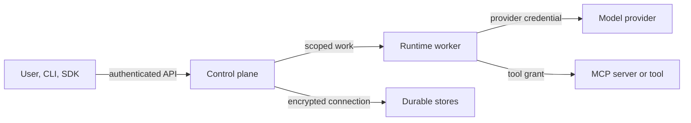

# Security Model

## Status

Security requirements apply from the first executable release. Authentication,
policy, approval, and isolation capabilities expand through v1.0.

## Security objectives

Corex AgentOS must:

- enforce least privilege for users, agents, workers, and tools;
- keep project data and credentials isolated;
- make sensitive side effects explicit and controllable;
- preserve an attributable audit trail;
- treat models, tools, retrieved content, and external services as untrusted;
- fail closed when authorization or policy state is unavailable.

## Trust boundaries

Crossing a boundary requires authenticated identity, validated input, explicit
authorization, and telemetry appropriate to the action.

## Identity and authentication

Initial releases support local identities and API keys. Keys are shown once,
stored as non-reversible verifiers where possible, scoped to a project and
capability, and revocable. External identity providers may be added later
without changing internal principal and role concepts.

Workers use workload identity or short-lived credentials. A worker never
receives a long-lived user session or unrestricted control-plane API key.

## Authorization

Authorization evaluates principal, project, action, resource, and relevant
conditions. Project scope is enforced in application logic and persistence
queries. Administrative APIs and worker APIs are separate capabilities.

Agent permissions are not inferred from the permissions of the person who
created the agent. Each published agent or workflow version has an explicit
effective tool/model policy.

## Credentials and secrets

- Secret values never appear in agent definitions, events, logs, or traces.
- Durable secrets are encrypted with managed key material and support rotation.
- Runtime credentials are resolved just in time and scoped to the requested
  provider or tool operation.
- Tool output and provider errors are scrubbed before persistence.
- Local development secrets use ignored environment files; `.env.example`
  contains names and safe defaults only.

## Tool and model risks

Prompt injection can arrive through users, retrieved documents, model output,
or tool results. Model output is never treated as authorization. Every tool call
is validated against its schema and effective permission immediately before
execution.

Tools declare side-effect and risk metadata. Policies can allow, deny, or
require approval. High-risk tools should use sandboxing, egress controls,
resource limits, and narrow external credentials.

## Human approval

Approval captures the requesting agent, exact operation, normalized arguments,
reason, applicable policy, approver, decision, and timestamp. Changing material
arguments invalidates the approval. The workflow pauses durably; approval does
not depend on an in-memory worker.

The requester cannot approve its own action unless an explicit policy permits
that relationship.

## Input and output protection

All external inputs have size, type, and schema limits. Rendered model content
is escaped in user interfaces. File paths, URLs, and command arguments receive
context-specific validation. Structured output is validated before use.

Rate limits, budgets, timeouts, and iteration limits protect availability and
cost. Denial-of-wallet is treated as an availability threat.

## Audit

Security-relevant actions produce append-oriented audit records with actor,
action, target, outcome, request correlation, and timestamp. Audit access is
more restricted than ordinary run inspection, and retention is configurable to
meet operator requirements.

## Supply chain and deployment

Production hardening includes locked dependencies, provenance, SBOMs,
vulnerability scanning, signed artifacts where practical, minimal container
images, non-root processes, read-only filesystems, and explicit network policy.

## Security review triggers

A security review is required when adding a new credential type, external
transport, executable tool, isolation boundary, public endpoint, authentication
provider, or mechanism that replays side effects.

Vulnerabilities should follow the repository security policy when `SECURITY.md`
is introduced; they should not be disclosed first in a public issue.

## Related documents

- [Agent Runtime](runtime.md)
- [Workflow Engine](workflow-engine.md)
- [Event Model](event-model.md)
