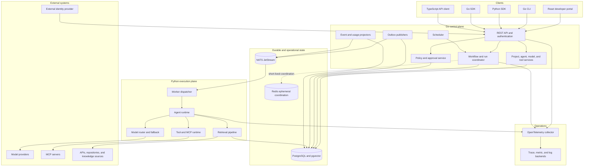
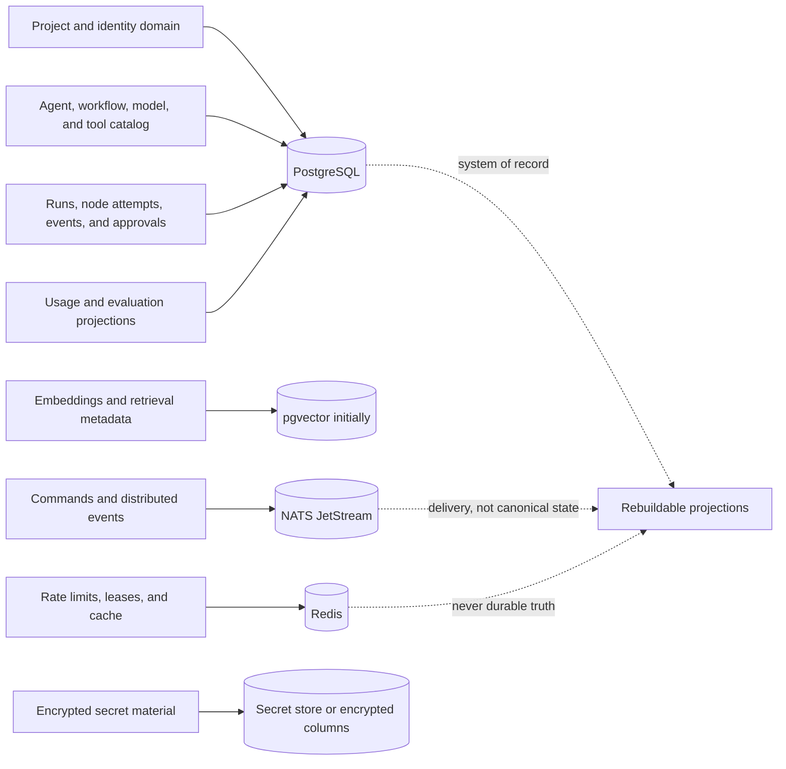
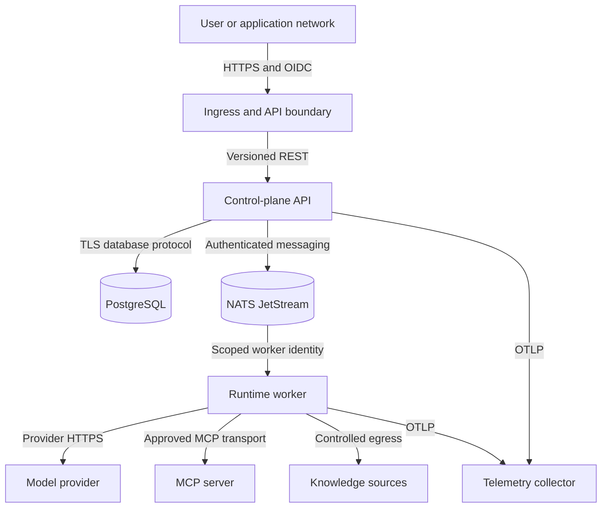
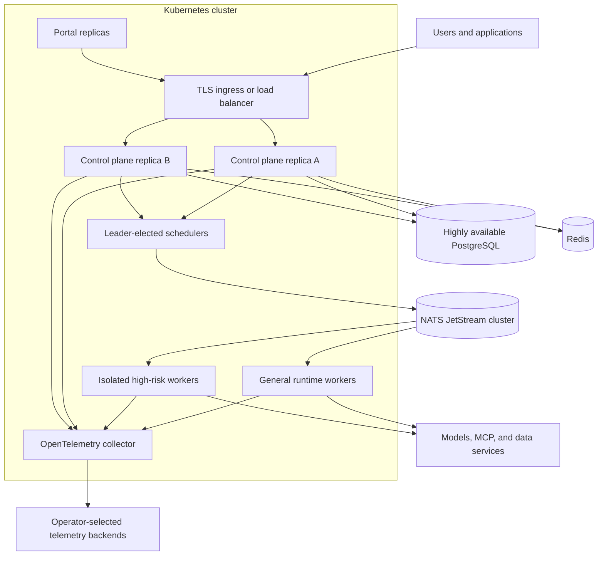
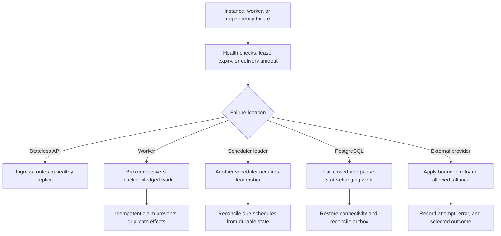
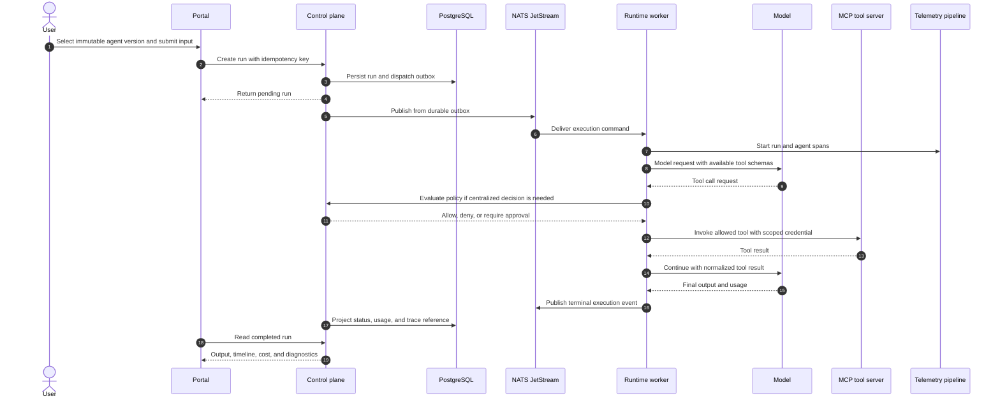

# Detailed System Design

## Status and scope

This document visualizes the target production architecture. Components enter
the repository incrementally according to the [roadmap](../../ROADMAP.md); the
diagram is not a statement that every service exists today.

## Container architecture

## Data ownership and access

| Data class | Owner | Consistency requirement | Retention |
| --- | --- | --- | --- |
| Projects and published definitions | Control plane | Transactional and strongly consistent | Until explicitly deleted |
| Runs, approvals, and audit metadata | Control plane | Durable and append-oriented | Operator policy |
| Execution commands and events | Producer plus stream | At-least-once delivery | Bounded stream policy |
| Trace, metric, and log signals | Observability pipeline | Best effort with visible loss | Backend policy |
| Cache, lease, and rate-limit state | Owning service | Reconstructable | Short-lived |
| Credentials | Credential service | Encrypted, scoped, and auditable | Rotation policy |

## Protocol and trust-boundary map

Every solid edge crosses a contract boundary. Authentication, authorization,
schema validation, timeouts, redaction, and telemetry are applied at the edge
appropriate to that protocol.

## Production deployment topology

Stateful dependencies may run inside or outside the cluster. Helm values must
support externally managed PostgreSQL, NATS, Redis, secret management, and
telemetry backends.

## High-availability and recovery flow

## End-to-end execution flow

## Related documents

- [Architecture Overview](overview.md)
- [User and Operator Flows](user-flows.md)
- [Security Model](security-model.md)
- [Observability](observability.md)
