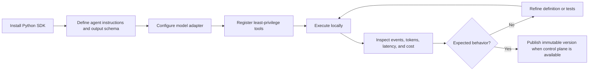
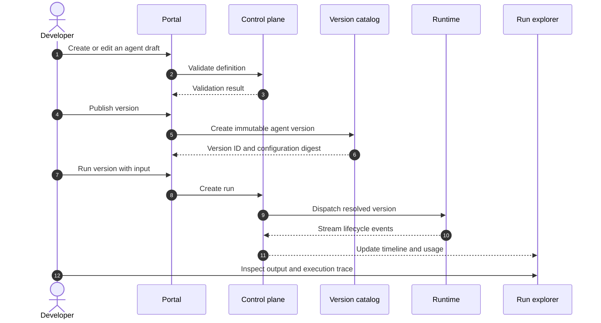
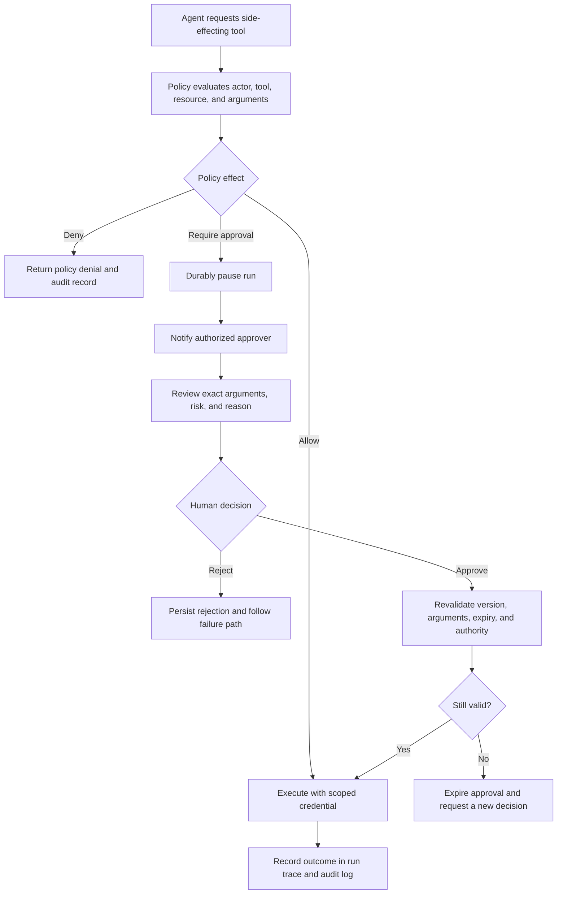
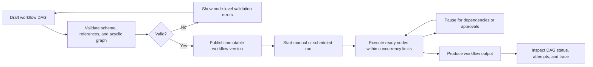
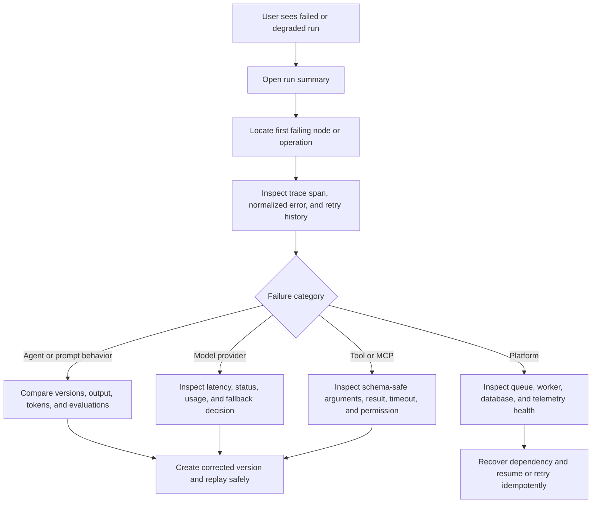
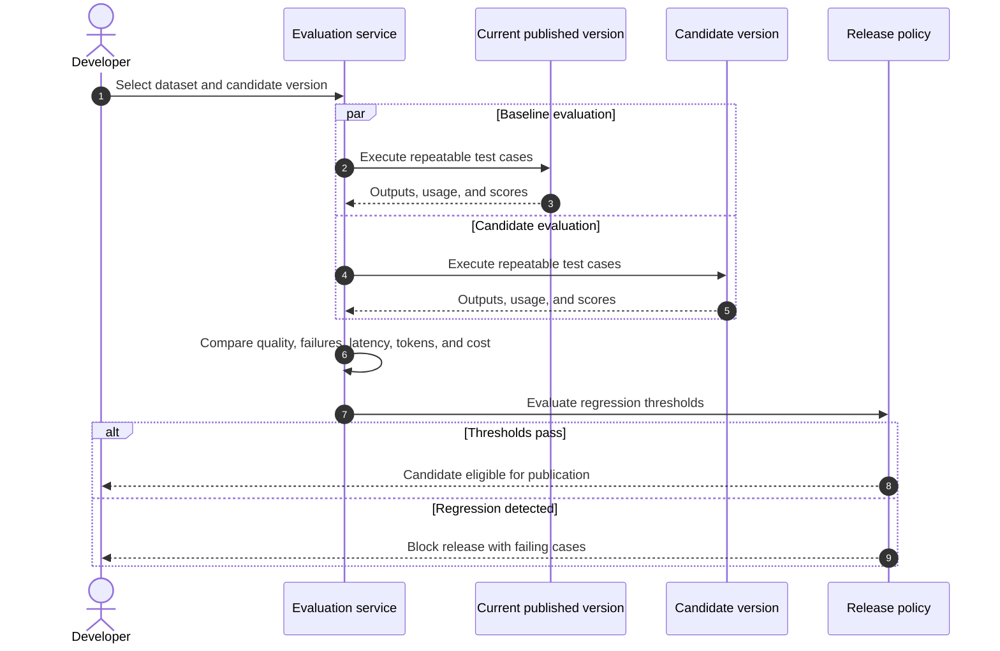
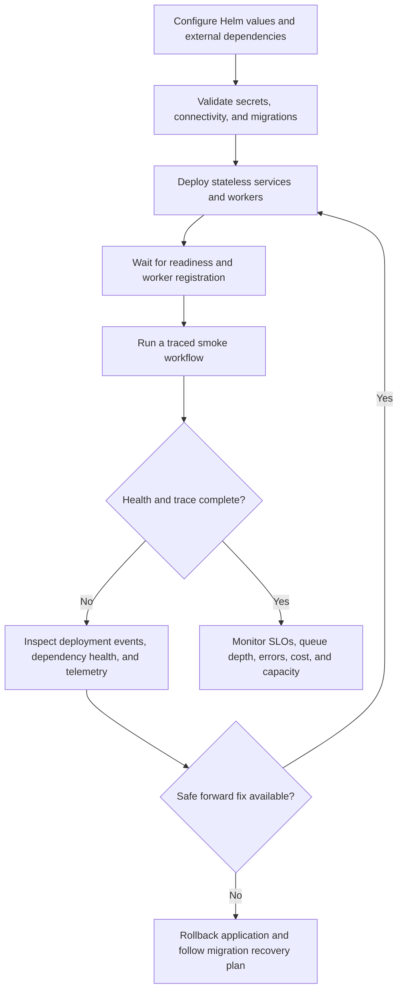
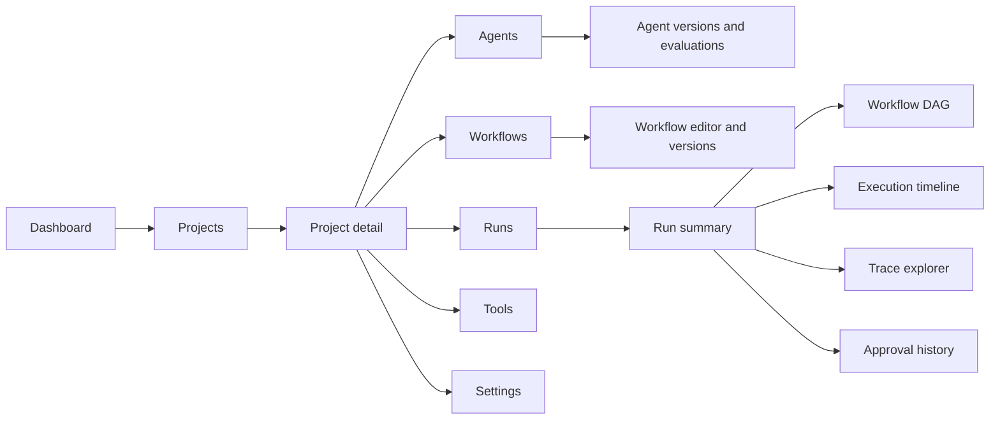

# User and Operator Flows

## Status and actors

These flows describe the intended product experience across roadmap releases.
Screens and APIs shown here may not exist during repository initialization.

Primary actors are:

- **Agent developer:** defines agents, tools, and workflows and runs them.
- **Reviewer or approver:** authorizes sensitive actions.
- **Operator:** deploys the platform and diagnoses reliability problems.
- **Application:** invokes published agents through an SDK or API.

## Flow 1: local agent development

## Flow 2: publish and run through the portal

## Flow 3: sensitive action approval

## Flow 4: build and execute a workflow

## Flow 5: diagnose a failed run

## Flow 6: evaluation and release gate

## Flow 7: operator deployment and recovery

## Navigation model

## Related documents

- [Detailed System Design](system-design.md)
- [Workflow Engine](workflow-engine.md)
- [Security Model](security-model.md)
- [Observability](observability.md)
