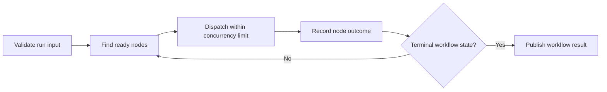
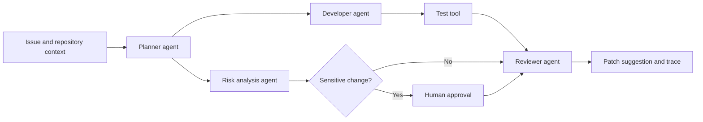
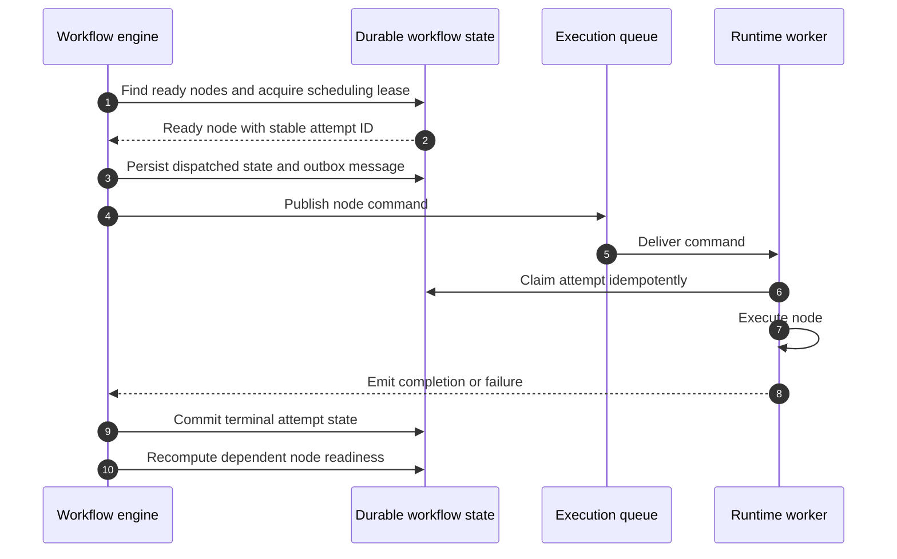
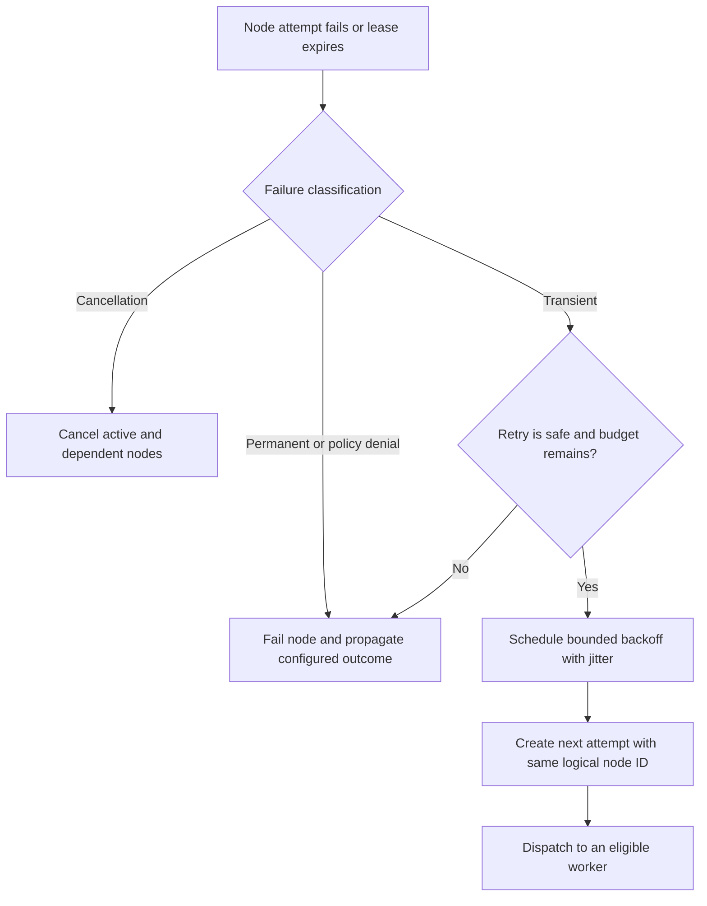

# Workflow Engine

## Status

Target architecture for v0.3 and later. Workflow behavior is not implemented
during repository initialization.

## Purpose

The workflow engine coordinates reliable, versioned graphs of agent and tool
work. It turns a declarative workflow definition into durable node executions
that can pause, retry, resume, and recover after process failure.

## Definition and versioning

A workflow definition declares inputs, nodes, dependencies, conditions, and
outputs. Publishing creates an immutable workflow version. Every run stores the
exact version identifier and resolved agent versions used for execution.

Validation occurs before publication and checks:

- schema version and unique node identifiers;
- valid node types and required configuration;
- references to existing immutable resources;
- acyclic dependencies;
- compatible input/output mappings;
- reachable nodes and valid conditions;
- configured limits for retries, timeouts, and parallelism.

The public schema lives under `packages/workflow-spec/` when introduced.

## Node types

Initial node types are:

- **Agent:** execute an immutable agent version.
- **Tool:** invoke an allowed tool without an agent loop.
- **Condition:** select downstream paths from explicit state.
- **Approval:** durably pause until an authorized decision arrives.

Future node types require schema versioning and must define retry,
cancellation, and side-effect semantics.

## Execution model

Node state is durable. Scheduling is a projection of node state and dependency
outcomes, not an in-memory task list. Multiple scheduler instances may inspect
the same run, so claiming and transition operations must be atomic.

### Example parallel workflow

### Node scheduling sequence

## State model

Workflow state contains immutable input, namespaced node outputs, and explicit
workflow output. Nodes may read only declared inputs and dependency outputs.
Updates are append-oriented or compare-and-set to prevent concurrent branches
from silently overwriting each other.

Large artifacts should be stored by reference rather than embedded in every
event or state row.

## Reliability

Each node execution has a stable attempt identifier and idempotency key.
Completion is accepted once; duplicate completion events are ignored. A lease
or heartbeat distinguishes active work from abandoned work without assuming a
worker is dead after a brief network interruption.

Retry policy is evaluated from the normalized failure category, node policy,
attempt count, deadline, and side-effect safety. Failure propagation can stop
the workflow, skip dependent nodes, or follow an explicitly configured error
path.

### Recovery decision flow

## Pause, resume, and cancellation

Approval nodes and external waits transition a run into a durable waiting
state. No worker must remain allocated while waiting. Resume validates the
decision and continues from newly ready nodes.

Cancellation prevents new nodes from being claimed and signals active nodes.
The final workflow outcome records nodes that completed, failed, skipped, or
were cancelled.

## Scheduling

Manual and scheduled workflows share the same run creation path. Cron or
calendar evaluation produces an idempotent occurrence key so scheduler retries
do not create duplicate runs. Time zone and missed-occurrence behavior must be
explicit configuration.

## Determinism and replay

The engine records resolved versions, node attempts, inputs, outputs, policy
decisions, and provider metadata required for diagnosis. Replay creates a new
run linked to the source run. It never silently reuses side effects; tool calls
must be re-executed, stubbed, or explicitly reused according to safe replay
policy.

## Observability

A workflow run is the root trace. Node attempts are child spans, and agent,
model, tool, retrieval, and approval operations nest beneath them. Workflow and
node identifiers appear in logs and structured events. See
[Observability](observability.md).

## Related documents

- [Control Plane](control-plane.md)
- [Agent Runtime](runtime.md)
- [Event Model](event-model.md)
- [Security Model](security-model.md)
