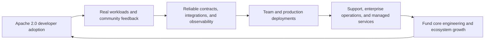
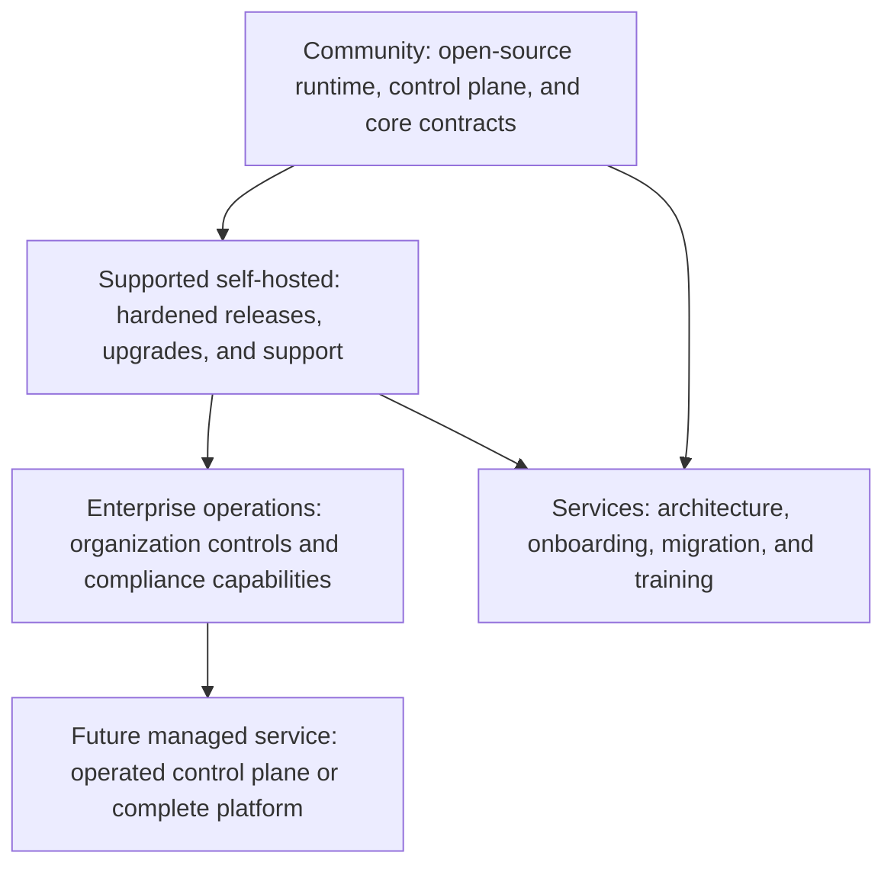
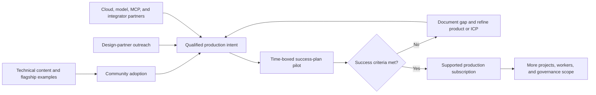

# Commercialization Strategy

## Status

Planning document for validation. Corex AgentOS is currently in repository and
v0.1 execution-foundation development; it is not yet a production commercial
platform.

## Commercial thesis

Corex AgentOS can become the neutral operational layer between production AI
agents and the models, tools, data, and infrastructure they use. The open-source
Apache 2.0 core lowers adoption friction and builds trust. Commercial value can
be created around safe production operation, organizational controls,
certification, support, and reduced integration effort.

The first commercial objective is not maximum feature breadth. It is proving
that a narrow group will repeatedly use, recommend, and pay to operate the
execution foundation in production.

## Problem statement

Teams deploying agents commonly assemble model adapters, tool execution,
workflow state, policy controls, tracing, evaluation, and cost reporting from
separate systems. This creates inconsistent contracts, weak auditability, and
high operational ownership.

Corex AgentOS aims to provide one self-hostable operational layer while
remaining model-, tool-, cloud-, and framework-independent.

## Initial ideal customer profiles

### AI product teams in regulated or security-sensitive environments

- Need self-hosting, explicit approvals, audit trails, and credential control.
- Operate agent workflows that can cause external side effects.
- Value governance and traceability more than a no-code builder.

### Platform engineering teams supporting multiple agent applications

- Want shared execution, observability, policy, and provider abstractions.
- Need to reduce duplicated infrastructure across product teams.
- Measure reliability, cost, and developer enablement across projects.

### AI consultancies and systems integrators

- Deliver multiple customer agent solutions.
- Need a repeatable, portable reference architecture.
- Can become both customers and distribution partners.

### Open-source and developer-led adopters

- Begin with local SDK/runtime usage.
- Contribute adapters, examples, and operational feedback.
- Create bottom-up pull for supported team deployments.

## Priority use cases

The flagship commercial proof should stay close to the roadmap's GitHub Issue
Fixer workflow because it exercises models, tools, approvals, traces, and
evaluation in one understandable flow.

Additional validation use cases are:

- governed research and knowledge workflows;
- internal engineering and operations agents;
- document or case-processing workflows requiring approval;
- shared agent infrastructure for several application teams.

Avoid positioning the platform as a general chatbot builder or replacement for
CI/CD, IDEs, Kubernetes, or model providers.

## Product and offer ladder

### Community distribution

The core remains useful under Apache 2.0. It should include the security and
observability necessary to run the advertised open-source platform safely.
Community success is measured through repeat usage and contribution quality,
not download counts alone.

### Supported self-hosted subscription

Potential paid value includes:

- supported release channels and long-term maintenance windows;
- upgrade planning, migration tooling, and incident support;
- certified deployment configurations and integrations;
- production architecture reviews and operational guidance;
- defined support response targets under contract.

### Enterprise operations

Potential post-v1 capabilities include organization management, enterprise
identity integration, advanced policy administration, compliance reporting,
multi-cluster controls, and enterprise audit export. Exact packaging remains a
hypothesis until design partners validate willingness to pay.

### Managed offering

A managed control plane or full hosted service may be evaluated after the
self-hosted product has stable contracts and known operating characteristics.
It should not distract from the project's self-hosting promise.

### Professional services and enablement

Time-bounded onboarding, architecture, integration, and training can generate
early revenue and accelerate learning. Services should produce reusable product
improvements rather than becoming unlimited bespoke development.

## Pricing research framework

No public price should be chosen before testing value and procurement behavior.
Research should compare:

- annual platform subscription by deployment or organization;
- usage-based managed execution or telemetry charges;
- support tiers based on response and coverage expectations;
- fixed-scope onboarding and architecture packages;
- partner-delivered services with referral or resale economics.

Every pricing interview should identify the economic buyer, budget category,
procurement threshold, alternative cost, required contract terms, and unit that
best tracks customer value without making spend unpredictable.

## Route to market

### Developer-led motion

Documentation, examples, transparent architecture, and reliable local setup
create adoption. Product telemetry must be opt-in and privacy-preserving; public
community signals should never be misrepresented as active production users.

### Design-partner motion

Recruit a small number of teams with an active workflow, a named technical
owner, production intent, and permission to provide structured feedback. Each
pilot has a written baseline, scope, security constraints, success criteria,
decision date, and conversion path.

### Partner-led motion

Integrators and technology partners can provide implementations, integrations,
cloud distribution, and customer access. The [Partner Program](partner-program.md)
defines qualification and governance.

## Commercial roadmap gates

| Technical milestone | Commercial evidence required | Potential offer |
| --- | --- | --- |
| v0.1 execution foundation | Repeat local runs, trace usefulness, provider/tool reliability | Design-partner access and paid advisory onboarding |
| v0.2 control plane | Multi-user/team demand and successful run inspection | Supported team pilot |
| v0.3 workflows | Durable workflow use case with measurable operational value | Annual supported self-hosted subscription |
| v0.4-v0.5 integrations and governance | Tool ecosystem demand, approval and audit requirements | Integration packs and enterprise evaluation |
| v0.6-v0.9 distributed hardening | Production concurrency, reliability, and support evidence | Production and enterprise tiers |
| v1.0 self-hosted platform | Reference deployments, upgrade success, security diligence | General commercial availability |

Roadmap completion alone does not open a commercial gate. Both technical and
customer evidence are required.

## Success metrics

### Product evidence

- time from installation to first traced successful run;
- weekly active projects with repeated successful executions;
- run success, retry, and trace-completeness rates;
- number of production-intent workflows and active agent versions;
- time to diagnose and resolve failed executions.

### Commercial evidence

- qualified design partners entering and completing pilots;
- pilot-to-paid conversion and time to production;
- annual recurring revenue and contracted backlog;
- gross and contribution margin by offer;
- renewal, expansion, contraction, and churn;
- support burden and services dependency per account.

### Ecosystem evidence

- maintained third-party MCP/model integrations;
- contributor retention and issue response health;
- partner-sourced qualified pipeline and revenue;
- certified integrations used in production.

Definitions and formulas are in
[Metrics and Financial Model](metrics-and-financial-model.md).

## Commercial risks and controls

| Risk | Control |
| --- | --- |
| Building before customer validation | Gate roadmap expansion with workflow and willingness-to-pay evidence |
| Open-source adoption without revenue | Design paid operational value around support, assurance, and organization needs |
| Services consuming the roadmap | Use fixed scope, reusable deliverables, and product-gap reviews |
| Cloud or model vendor commoditization | Preserve portability, neutral contracts, and self-hosting |
| Security incident damaging trust | Apply secure defaults, disclosure processes, audits, and scoped credentials |
| Pricing disconnected from value | Run structured research and monitor expansion, margin, and procurement friction |
| Enterprise customization fragmentation | Require configuration or general product capability before bespoke forks |

## Next validation actions

1. Define one v0.1 design-partner success plan around the flagship workflow.
2. Conduct problem and procurement interviews with each initial customer
   profile.
3. Instrument only the product metrics required to measure first value and
   reliable repeat usage.
4. Test supported self-hosted and fixed-scope onboarding offers before building
   enterprise packaging.
5. Record evidence using the observed, validated, hypothesis, and target labels
   defined in the [business documentation index](README.md).
