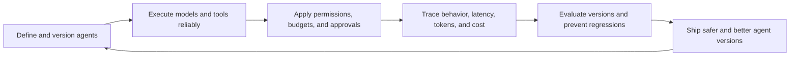
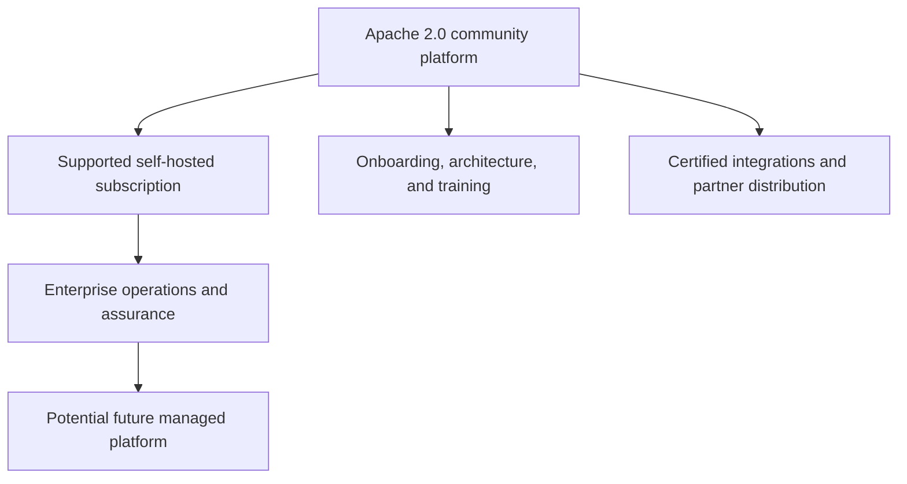
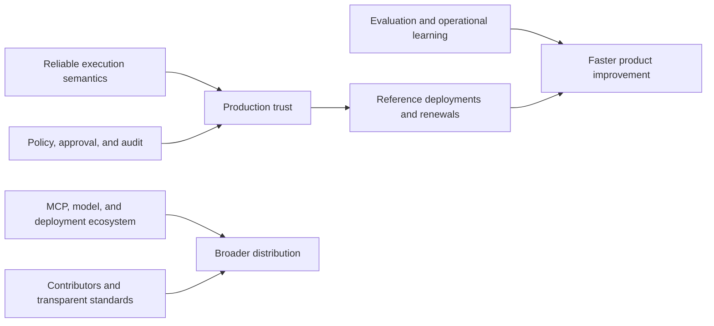
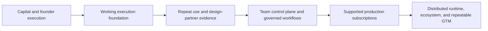

# Investor Brief

## Document status

Discussion draft. This is not an investment offer, financial forecast, or
representation of audited traction. Metrics must be inserted only from the
evidence sources defined in
[Metrics and Financial Model](metrics-and-financial-model.md).

## Executive summary

Corex AgentOS is building open-source infrastructure for executing,
orchestrating, governing, tracing, and evaluating production AI agents. The
project's thesis is that teams will need a neutral operational layer across
models, tools, frameworks, and deployment environments—especially when agents
can take consequential actions.

The product begins with a reliable local Python execution foundation and grows
into a distributed, self-hosted platform with a Go control plane, durable
workflows, MCP integrations, governance, evaluation, and AgentOps.

Current state: the repository, portal foundation, roadmap, workspace boundaries,
architecture documentation, and core technology decisions are initialized.
Production runtime and commercial claims are not yet complete.

## The problem

Agent teams frequently own a fragmented stack for model routing, tool execution,
workflow state, permissions, approval, tracing, evaluation, and cost. This
fragmentation makes behavior difficult to reproduce, failures slow to diagnose,
and sensitive actions hard to govern.

The problem becomes more valuable as organizations move from demonstrations to
repeated workflows with side effects, multiple teams, and production
accountability.

## The product thesis

Corex AgentOS is not a foundation model or a general chatbot builder. It is the
operational lifecycle layer around agents built with different models,
frameworks, tools, and infrastructure.

## Why open source

- Production infrastructure earns trust through inspectability and portability.
- Self-hosting matters for security-sensitive data and actions.
- Open protocols and community integrations can expand coverage faster than a
  proprietary connector backlog.
- Developers can adopt locally before a centralized purchase.
- A neutral project can serve teams that do not want one model or cloud vendor
  to own their operational control layer.

The Apache 2.0 license also means defensibility cannot rely on code access
alone. It must come from execution quality, trusted distribution, operational
expertise, ecosystem depth, customer relationships, brand, and pace of learning.

## Market-entry wedge

The initial wedge is engineering and operational agent workflows that use
external tools and require traceability. The flagship GitHub Issue Fixer makes
the value legible: it plans, reads a repository, proposes changes, tests,
requests human approval, and produces a traceable patch suggestion.

Initial customer hypotheses are:

- AI product teams in regulated or security-sensitive organizations;
- platform teams standardizing infrastructure for several agent applications;
- consultancies and systems integrators delivering repeatable agent systems;
- developer-led teams graduating from local agents to governed production use.

These remain hypotheses until supported by documented interviews, pilots, and
paid deployment evidence.

## Business model

Potential revenue streams are annual self-hosted subscriptions, enterprise
operations capabilities, support, managed service usage, fixed-scope services,
training, certification, and partner marketplace economics. Packaging and
prices are validation work, not current commitments.

## Technology strategy

- Python runtime for model, tool, retrieval, and evaluation ecosystem access.
- Go control plane for APIs, durable coordination, scheduling, and operations.
- MCP-first external tools to encourage portable integrations.
- PostgreSQL as durable source of truth, with pgvector initially.
- NATS JetStream for distributed delivery when v0.6 requires it.
- OpenTelemetry for replaceable operational telemetry.
- React and TypeScript for the developer portal.

The architecture starts modular and local, adding distributed infrastructure
only when product milestones require it.

## Defensibility

Defensibility must be measured through actual reliability, repeat deployments,
renewals, integration usage, contribution health, and time-to-resolution—not
through feature-count claims.

## Stage and milestone plan

### Foundation milestone

- Execute a real local agent with model and tool abstractions.
- Capture a complete trace, normalized errors, usage, latency, and estimated
  cost.
- Demonstrate repeat usage with design partners.

### Team platform milestone

- Deliver control-plane APIs, PostgreSQL persistence, portal run inspection,
  projects, versions, and API keys.
- Convert successful design partners into supported team deployments.

### Governed workflow milestone

- Deliver durable workflows, MCP tools, policies, approvals, and evaluations.
- Prove measurable value in production-intent workflows.

### Production platform milestone

- Deliver distributed workers, AgentOps, hardening, upgrades, and self-hosted
  Kubernetes packaging.
- Establish reference customers, reliable renewals, and repeatable deployment.

## Capital thesis

External capital may be appropriate when it can accelerate validated demand
without forcing premature infrastructure or enterprise breadth. Financing
should fund milestone risk reduction rather than feature volume.

Illustrative use-of-funds ranges for planning—not a commitment—are:

| Area | Planning range | Purpose |
| --- | ---: | --- |
| Core engineering and security | 50-60% | Runtime, contracts, control plane, testing, and hardening |
| Developer experience and ecosystem | 10-15% | SDKs, docs, examples, integrations, and community |
| Design partners and go-to-market | 15-20% | Customer discovery, pilots, technical sales, and references |
| Operations, legal, and compliance | 10-15% | Company operations, licensing, contracts, security, and finance |
| Contingency | 5-10% | Provider, infrastructure, and timing uncertainty |

A financing plan must state the amount, instrument, valuation mechanics,
runway target, hiring plan, and milestone budget after professional legal and
financial review.

## Milestone-based financing narrative

Each stage should define the technical proof, customer evidence, budget,
staffing, and next financing decision before capital is committed.

## Investor evidence dashboard

Do not fill this dashboard with estimates presented as actuals.

| Category | Evidence to report | Source |
| --- | --- | --- |
| Product | Successful traced runs, repeat active projects, reliability | Product telemetry |
| Customer | Qualified interviews, pilots, conversions, references | CRM and signed pilot plans |
| Revenue | ARR, contracted backlog, services revenue, collections | Accounting and contracts |
| Retention | Logo retention, gross retention, net retention, expansion | Billing and CRM cohorts |
| Efficiency | Burn, runway, gross margin, CAC, payback | Accounting plus attribution |
| Ecosystem | Maintained integrations, contributors, partner pipeline | Repository and partner records |
| Security | Review status, incidents, remediation, dependency posture | Security register |

## Principal risks

| Risk | Mitigation and evidence required |
| --- | --- |
| Large vendors bundle similar features | Win on neutrality, self-hosting, open contracts, and cross-provider operations |
| Agent infrastructure demand remains experimental | Require production-intent workflows and paid validation before scaling |
| Open-source project fails to monetize | Validate support and enterprise value early; track conversion cohorts |
| Technical scope exceeds team capacity | Preserve release gates and modular-before-microservices principle |
| Security failure reduces trust | Build least privilege, redaction, approvals, isolation, and disclosure discipline |
| Services obscure product-market evidence | Separate services margin and require reusable product outcomes |
| Model or protocol change invalidates adapters | Maintain provider-neutral contracts and explicit compatibility tests |

## Diligence package to prepare

- incorporation, capitalization, IP assignment, contributor, license, and
  trademark records;
- repository ownership, dependency, security, and release processes;
- roadmap with evidence gates and current delivery status;
- customer interview notes, pilot plans, contracts, references, and pipeline;
- monthly financial statements, cash, burn, runway, and scenario model;
- hiring plan, compensation assumptions, and use-of-funds model;
- risk register, privacy/security policies, and incident history;
- partner agreements and material infrastructure/provider commitments.

## The current ask

Before external use, replace this section with a board-approved, specific ask:
capital amount and instrument, milestone runway, hiring plan, intended investor
profile, strategic help requested, and round timing. Until those facts are
approved, this brief should be used for internal preparation and exploratory
conversation only.
