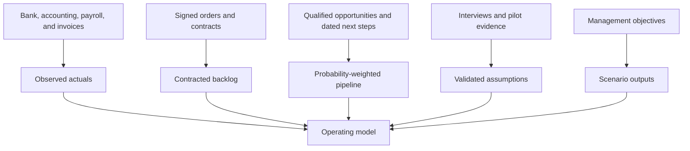
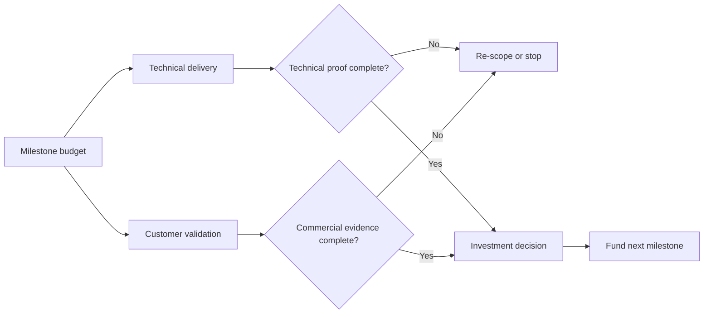

# Metrics and Financial Model

## Purpose

This document defines an auditable model structure for commercialization and
investment planning. It intentionally contains formulas and scenario inputs,
not invented customer counts, market sizes, prices, revenue, or forecasts.

## Modeling principles

- Separate observed actuals, contracted amounts, management targets, and model
  assumptions.
- Track community usage separately from qualified commercial demand.
- Build revenue from customer and usage drivers rather than applying a top-down
  market-share percentage.
- Model services, subscriptions, and managed usage independently because their
  margins and capacity constraints differ.
- Reconcile monthly model outputs to accounting statements and cash.
- Preserve base, downside, and upside scenarios without hiding the downside.

## Evidence hierarchy



Repository stars, page views, sign-ups, or downloads are not revenue and should
not be converted to commercial pipeline without qualification evidence.

## Core input tabs

An accompanying spreadsheet should have controlled inputs for:

1. **Actuals:** historical profit and loss, balance sheet, and cash flow.
2. **Customers:** opening accounts, new wins, churn, expansion, pricing, and
   billing terms by segment.
3. **Usage:** managed runs, tokens, storage, telemetry, and provider costs.
4. **Services:** projects, billable capacity, rates, utilization, and delivery
   costs.
5. **People:** role, location, start date, salary, benefits, tax, equipment, and
   recruiting cost.
6. **Infrastructure:** fixed platform cost and variable unit cost drivers.
7. **Sales and marketing:** programs, headcount, commissions, travel, and
   attribution.
8. **Corporate:** legal, audit, insurance, security, facilities, and software.
9. **Financing:** opening cash, investment tranches, fees, debt, and interest.
10. **Scenarios:** named assumptions changed only through input cells.

## Revenue model

### Subscription revenue

For each customer segment and month:

```text
closing_customers = opening_customers + new_customers - churned_customers
average_customers = (opening_customers + closing_customers) / 2
subscription_revenue = average_customers * average_monthly_subscription
ending_arr = closing_customers * average_monthly_subscription * 12
```

Expansion and contraction should be separate drivers rather than hidden inside
average price.

### Managed usage revenue

```text
usage_revenue = billable_units * realized_price_per_unit
usage_cogs = billable_units * variable_cost_per_unit
usage_gross_margin = (usage_revenue - usage_cogs) / usage_revenue
```

Model runs, tokens, storage, and telemetry separately if their cost behavior is
materially different. Pass-through model spending should not be counted as
high-margin platform revenue.

### Services revenue

```text
billable_hours = delivery_headcount * available_hours * utilization
services_revenue = billable_hours * realized_hourly_rate
services_gross_profit = services_revenue - delivery_payroll - subcontractors - delivery_expenses
```

Deferred revenue and revenue recognition must follow applicable accounting
policy; cash collected is not automatically recognized revenue.

## SaaS and commercial metrics

| Metric | Definition |
| --- | --- |
| ARR | Recurring monthly subscription value at period end multiplied by 12 |
| Gross revenue retention | Opening recurring revenue retained, excluding expansion, divided by opening recurring revenue |
| Net revenue retention | Retained recurring revenue plus expansion, divided by opening recurring revenue |
| Logo retention | Retained customers divided by opening customers |
| Average contract value | Contracted recurring value divided by contracted customers |
| Qualified pipeline | Opportunities meeting documented qualification criteria |
| Win rate | Closed-won opportunities divided by eligible closed opportunities |
| Sales cycle | Median days from qualified opportunity to signed agreement |
| CAC | Attributable sales and marketing cost divided by new customers |
| CAC payback | CAC divided by monthly new-customer gross profit |
| Gross margin | Revenue less direct cost of revenue, divided by revenue |

Report definitions, cohort period, exclusions, and data source beside every
metric.

## Open-source funnel metrics


Measure stage conversion by cohort. A company email address or GitHub star
does not by itself establish production intent.

## Cost of revenue

Direct costs may include:

- managed compute, storage, network, model, and telemetry consumption;
- customer-specific infrastructure;
- support and customer reliability staffing attributable to service delivery;
- third-party royalties, marketplace fees, or partner revenue share;
- services delivery payroll and subcontractors;
- payment processing and support tooling where material.

Engineering for the general product is normally operating expense, while
customer-specific delivery may be cost of revenue subject to accounting review.

## Cash, burn, and runway

```text
net_burn = cash_operating_outflows - cash_operating_inflows
runway_months = unrestricted_cash / normalized_monthly_net_burn
```

Runway based on a single recent month can be misleading. Show trailing average,
forward committed burn, hiring plan, and downside case. Model payroll timing,
annual prepayments, tax, financing fees, receivables, and deferred collections.

## Scenario matrix

| Driver | Downside | Base | Upside |
| --- | --- | --- | --- |
| v0.1 evidence date | Input | Input | Input |
| Qualified pilots started | Input | Input | Input |
| Pilot-to-paid conversion | Input | Input | Input |
| Average subscription | Input | Input | Input |
| Gross retention | Input | Input | Input |
| Expansion rate | Input | Input | Input |
| Hiring start dates | Input | Input | Input |
| Infrastructure cost per unit | Input | Input | Input |
| Fundraising amount and close date | Input | Input | Input |

The downside case should delay product milestones and fundraising, reduce
conversion and price, increase sales cycle, and preserve realistic fixed costs.

## Milestone budget

Each technical milestone receives:

- required roles and start dates;
- infrastructure, security, legal, and partner dependencies;
- expected customer evidence;
- direct and shared budget;
- completion definition;
- stop, continue, or re-scope decision criteria.



## Monthly reporting pack

- cash, burn, runway, revenue, gross profit, and variance to plan;
- ARR bridge: opening, new, expansion, contraction, churn, and closing;
- pipeline by stage, source, age, next step, and expected close date;
- product funnel and reliability cohorts;
- hiring plan versus actual starts and total fully loaded headcount;
- security, operational, customer, and partner risks;
- milestone progress and decisions required.

## Controls

- Lock historical actuals after accounting close.
- Record owner, source, date, and rationale for every material assumption.
- Require review for changes to price, conversion, churn, hiring, or financing.
- Reconcile ARR to the customer contract schedule and revenue to accounting.
- Maintain one canonical model; investor extracts should trace to it.
- Have qualified legal, tax, and accounting advisers review external materials.
