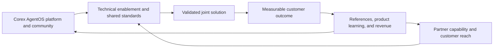
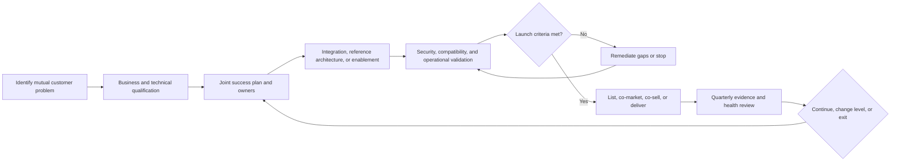
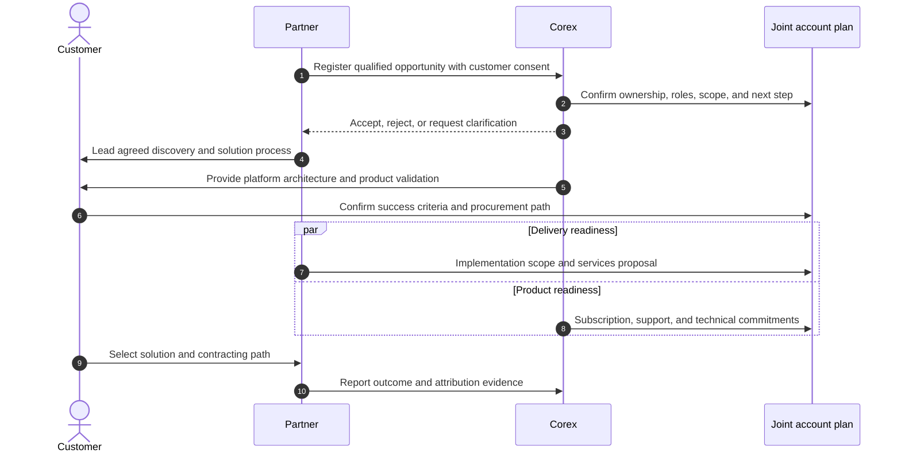

# Partner Program

## Status

Program design for validation. Participation tiers, certifications, economics,
and benefits are not available until formally launched and documented in signed
agreements.

## Program objective

The Corex AgentOS partner program should expand trusted integrations,
deployment options, implementation capacity, and market access without
compromising open standards, customer choice, security, or roadmap discipline.

## Partner categories

### Technology partners

Model providers, MCP server vendors, data platforms, vector stores,
observability tools, identity providers, and security products that integrate
with Corex contracts.

### Infrastructure and cloud partners

Cloud, Kubernetes, database, messaging, and platform providers supporting
tested deployment patterns, marketplace distribution, or joint operations.

### Solution and delivery partners

Consultancies, systems integrators, and managed service providers that design,
implement, migrate, and operate agent systems for customers.

### Design partners

End-user organizations collaborating on a defined production-intent workflow.
Design partnership is a product-validation relationship, not an implied product
endorsement.

### Research and community partners

Universities, open-source projects, standards communities, and educational
organizations contributing research, interoperability, examples, or talent.

## Proposed participation levels

| Level | Intended relationship | Minimum evidence |
| --- | --- | --- |
| Ecosystem | Listed compatible project or service | Maintained public integration and named owner |
| Verified | Tested integration or trained delivery capability | Passing validation, documentation, support path, and review cadence |
| Strategic | Material joint product, distribution, or customer plan | Executive sponsors, joint plan, measurable pipeline or adoption, and governance |

Levels are earned through current evidence and can be suspended when maintenance,
security, customer experience, or agreement requirements are not met.

## Qualification criteria

Every partner must have:

- a clear customer or ecosystem value proposition;
- named business and technical owners;
- compatible security, privacy, and responsible-AI practices;
- a maintained integration or delivery capability;
- support and escalation contacts;
- accurate use of names, marks, compatibility claims, and roadmap statements;
- acceptance of contribution and licensing rules where applicable.

Strategic partners additionally require a joint business plan, measurable
outcomes, executive review, and a defined exit or renewal decision.

## Engagement lifecycle

## Technical validation

Technology integrations should pass:

- supported-version and compatibility tests;
- installation, configuration, upgrade, and removal tests;
- authentication, authorization, and least-privilege review;
- timeout, retry, cancellation, and error-normalization tests;
- telemetry, redaction, and audit verification;
- load and failure testing proportionate to the integration;
- documentation and example review;
- vulnerability and dependency review.

MCP discovery never grants tool permission automatically. Verified tools still
require Corex-side risk, side-effect, timeout, and policy metadata.

## Solution-partner enablement

Delivery partners should demonstrate:

- architecture and deployment understanding;
- ability to define safe agent and workflow boundaries;
- production operations, incident, and upgrade capability;
- security and data-handling competence;
- transparent scoping and customer ownership of deliverables;
- a feedback path that converts recurring gaps into product proposals.

Potential enablement includes training, labs, implementation playbooks,
reference architectures, demo environments, and technical office hours.
Certification should be evidence-based and time-limited.

## Design-partner framework

Each design-partner engagement has a signed or acknowledged charter containing:

- problem, current baseline, and production intent;
- in-scope workflow, systems, data, users, and exclusions;
- technical and commercial success criteria;
- security, privacy, and deployment constraints;
- meeting cadence and named owners;
- feedback, confidentiality, IP, publicity, and reference terms;
- target decision date and paid conversion hypothesis;
- termination and data-return or deletion process.

Free pilots without a decision owner, success criteria, or conversion path do
not qualify as design partnerships.

## Joint customer flow

Customer choice and consent take priority over deal registration. Opportunity
data is shared only under appropriate agreements and access controls.

## Partner benefits hypotheses

Benefits may include, subject to level and agreement:

- technical enablement and roadmap briefings;
- integration review and compatibility listing;
- reference architectures and shared demonstrations;
- joint content, events, and launch planning;
- qualified lead referral or co-selling;
- marketplace or reseller paths;
- support escalation and early compatibility testing;
- partner directory profile and approved mark usage.

Benefits must be tied to maintained capability and measurable customer value,
not logo exchange.

## Commercial models

Potential models include referral fees, reseller discount, marketplace revenue
share, services subcontracting, technology bundling, and jointly funded
development. Before approval, each model must define:

- attribution and deal-registration rules;
- customer contracting and billing owner;
- discount, fee, or revenue-share calculation;
- refunds, taxes, foreign exchange, and payment timing;
- support, warranty, indemnity, and liability responsibilities;
- renewal, expansion, and termination treatment;
- anti-corruption, sanctions, privacy, and competition compliance.

No employee or contributor should promise partner economics outside an approved
written agreement.

## Governance and conflict management

- Product roadmap priority is not purchased through partnership status.
- Security issues can suspend an integration or listing immediately.
- Paid placement and technical compatibility are labeled separately.
- Partners disclose material conflicts and competing commitments.
- Customer references require explicit permission.
- Joint claims identify which party operates and supports each component.
- Contributions follow the same review and license policy as community work.

## Partner scorecard

| Dimension | Example evidence |
| --- | --- |
| Customer value | Successful deployments, outcomes, references, and satisfaction |
| Technical health | Compatibility pass rate, maintenance latency, incidents, and upgrades |
| Commercial contribution | Qualified pipeline, sourced revenue, influence, and renewal |
| Enablement | Trained practitioners, completed labs, and delivery readiness |
| Community contribution | Maintained code, docs, examples, and issue support |
| Operational quality | Escalation response, security posture, and plan execution |

Review scorecards quarterly for strategic partners and at least annually for
verified partners. Record evidence sources rather than relying on subjective
labels.

## Launch sequence

1. Validate one design-partner charter and one technology integration process.
2. Publish compatibility criteria and contribution rules.
3. Pilot solution-partner enablement with a small, accountable cohort.
4. Establish legal templates for confidentiality, data handling, referrals,
   trademarks, and joint delivery.
5. Launch a public directory only after listing and removal processes work.
6. Add tiers or economics only when evidence shows they improve customer
   outcomes and repeatable distribution.

## Contact and ownership placeholders

Before external publication, assign:

- program executive owner;
- technical certification owner;
- partner operations contact and intake channel;
- security escalation channel;
- legal approval owner;
- opportunity registration and dispute process.
