# Complete Capability Catalog

## How to read this catalog

The release column is the target from the [roadmap](../../ROADMAP.md), not a
delivery guarantee. **Initialized** means only repository scaffolding or a UI
shell exists today.

## 1. Repository and developer foundation

| Capability | What it enables | Target |
| --- | --- | --- |
| Monorepo workspaces | Organize Go, Python, and TypeScript components | Initialized |
| React portal shell | Develop the future management interface | Initialized |
| Architecture and ADR documentation | Review intended system boundaries and decisions | Initialized |
| Python SDK package | Provide agent-facing developer APIs | v0.1 |
| Local examples | Demonstrate supported usage patterns | v0.1 onward |
| Versioned SDKs and clients | Integrate through Python, Go, and TypeScript | v0.8 |
| Plugin development contracts | Extend providers, stores, evaluators, and exporters | v0.8 |

## 2. Agent definition and lifecycle

| Capability | What it enables | Target |
| --- | --- | --- |
| Agent configuration | Define name, instructions, model, tools, and limits | v0.1 |
| Structured input and output | Validate typed execution contracts | v0.1 |
| Agent execution context | Carry IDs, deadline, permissions, budgets, and trace context | v0.1 |
| Lifecycle hooks | Observe start, completion, failure, and cancellation | v0.1 |
| Cancellation | Stop active execution cooperatively | v0.1 |
| Execution timeout | Bound wall-clock runtime | v0.1 |
| Retry handling | Retry classified transient failures safely | v0.1 |
| Normalized error model | Handle failures consistently across providers and tools | v0.1 |
| Agent registry | Resolve named agent definitions | v0.1-v0.2 |
| Immutable agent versions | Reproduce the exact configuration used by a run | v0.2 |
| Agent version comparison | Compare behavior, usage, and configuration | v0.7 |

## 3. Model capabilities

| Capability | What it enables | Target |
| --- | --- | --- |
| Provider-independent interface | Change providers without rewriting agent logic | v0.1 |
| OpenAI-compatible provider | Use compatible hosted or self-hosted endpoints | v0.1 |
| Anthropic provider | Use supported Anthropic models | v0.1 |
| Ollama provider | Use supported local models | v0.1 |
| Chat completion | Generate agent responses | v0.1 |
| Streaming | Consume incremental model output | v0.1 |
| Structured output | Validate model output against a schema | v0.1 |
| Tool calling | Let a model request registered tools | v0.1 |
| Token usage collection | Measure input and output token consumption | v0.1 |
| Provider error normalization | Classify retryable and terminal provider failures | v0.1 |
| Provider timeout | Bound model call duration | v0.1 |
| Model fallback | Select an allowed replacement after qualifying failure | v0.1 |
| Model catalog and credentials | Manage models centrally by project | v0.2 |
| Model usage and cost comparison | Compare provider/model economics and latency | v0.7 |

## 4. Tool and MCP capabilities

| Capability | What it enables | Target |
| --- | --- | --- |
| Tool interface | Represent an executable capability consistently | v0.1 |
| Tool registration | Make approved tools available to an agent | v0.1 |
| JSON Schema arguments | Validate tool requests before execution | v0.1 |
| Tool result contract | Return normalized success or failure | v0.1 |
| Tool timeout and errors | Bound and diagnose tool execution | v0.1 |
| Tool execution metadata | Trace tool identity, duration, and outcome | v0.1 |
| Tool permission check | Prevent unapproved invocation | v0.1 foundation, v0.5 policy |
| MCP server registration | Connect an external MCP server | v0.4 |
| MCP tool discovery | Discover server capabilities and schemas | v0.4 |
| MCP client lifecycle | Connect, monitor, and close clients safely | v0.4 |
| MCP server health | Detect unavailable or degraded integrations | v0.4 |
| Selective tool exposure | Grant only chosen MCP tools to an agent | v0.4 |
| MCP invocation tracing | Inspect external tool requests and outcomes | v0.4 |
| GitHub and filesystem MCP examples | Demonstrate flagship integrations | v0.4 onward |

## 5. Run management

| Capability | What it enables | Target |
| --- | --- | --- |
| Local run | Execute one agent from the Python SDK | v0.1 |
| Complete execution trace | Inspect model, tool, error, token, and cost activity | v0.1 |
| Central run creation | Start a run through the control-plane API | v0.2 |
| Run status and result | Query pending, running, waiting, or terminal state | v0.2 |
| Run cancellation | Request cancellation through the API | v0.2 |
| Idempotent run creation | Retry requests without duplicate runs | v0.2 |
| Run explorer | Inspect run timeline through the portal | v0.2 |
| Run logs and CLI inspection | Inspect runs outside the portal | v0.2 |
| Distributed execution | Execute across worker pools | v0.6 |
| Run comparison | Compare two executions | v0.7 |
| Safe replay | Re-execute with explicit side-effect policy | v0.7 |

## 6. Project and resource management

| Capability | What it enables | Target |
| --- | --- | --- |
| Projects | Isolate resources, users, credentials, and usage | v0.2 |
| Agent and workflow catalog | List and manage definitions and versions | v0.2-v0.3 |
| Model and tool catalog | Register project-approved capabilities | v0.2 |
| Credential metadata | Reference scoped secrets without embedding values | v0.2 |
| REST API | Manage platform resources programmatically | v0.2 |
| Pagination and filtering | Query large resource collections | v0.2 |
| Structured API errors | Build stable client error handling | v0.2 |
| Request validation | Reject invalid resources before persistence | v0.2 |
| Developer portal | Manage resources visually | v0.2 onward |
| CLI | Manage and inspect resources from a terminal | v0.2 onward |

## 7. Workflow orchestration

| Capability | What it enables | Target |
| --- | --- | --- |
| Versioned workflow specification | Define portable workflow graphs | v0.3 |
| Sequential nodes | Run steps in order | v0.3 |
| Parallel nodes | Run independent steps concurrently | v0.3 |
| DAG dependencies | Start nodes only after dependencies complete | v0.3 |
| Conditional nodes | Choose paths from explicit state | v0.3 |
| Agent nodes | Execute published agents within workflows | v0.3 |
| Tool nodes | Invoke a tool without an agent loop | v0.3 |
| Human approval nodes | Pause for an authorized decision | v0.3 foundation, v0.5 governance |
| Workflow input and output | Validate workflow boundary contracts | v0.3 |
| Shared explicit state | Pass declared values between nodes | v0.3 |
| Node retries and backoff | Recover from transient node failures | v0.3 |
| Node timeouts and cancellation | Bound and stop workflow work | v0.3 |
| Failure propagation | Stop, skip, or follow configured error paths | v0.3 |
| Durable resume | Continue after pause or process failure | v0.3 |
| Idempotent node execution | Tolerate duplicate delivery | v0.3 |
| Immutable workflow versions | Reproduce a workflow run | v0.3 |
| Manual execution | Start a workflow on demand | v0.3 |
| Cron scheduling | Start workflows from schedules | v0.3 |
| Workflow editor and DAG view | Design and inspect graphs visually | v0.3 |

## 8. Knowledge, retrieval, and memory

| Capability | What it enables | Target |
| --- | --- | --- |
| File and document sources | Ingest approved content | v0.4 |
| Repository sources | Retrieve relevant code and documentation | v0.4 |
| Web or API sources | Ingest allowed remote information | v0.4, integration-dependent |
| Structured-record sources | Retrieve database or business records | v0.4, integration-dependent |
| Ingestion pipeline | Convert sources into searchable units | v0.4 |
| Chunking | Split content using replaceable strategies | v0.4 |
| Embeddings | Produce vector representations through adapters | v0.4 |
| PostgreSQL and pgvector | Store and query initial vector data | v0.4 |
| Retrieval | Select relevant context for a run | v0.4 |
| Reranking | Improve result ordering | v0.4 |
| Retrieval tracing | Show sources, latency, and selected context | v0.4-v0.7 |
| Run-scoped memory | Retain explicit state during one run | v0.4 |
| Agent memory | Retain configured agent-level state | v0.4 |
| Conversation memory | Retain configured conversation state | v0.4 |
| Persistent memory interface | Support replaceable long-term stores | v0.4 |
| Additional vector stores | Use Qdrant, Chroma, or other adapters | Beyond initial v1 or ecosystem |

## 9. Governance and safety

| Capability | What it enables | Target |
| --- | --- | --- |
| Policy targets | Apply policy to agents, models, tools, servers, projects, and workflows | v0.5 |
| Allow policy | Permit a matching action | v0.5 |
| Deny policy | Block a matching action | v0.5 |
| Require-approval policy | Pause before a matching action | v0.5 |
| Approval request | Capture agent, operation, arguments, reason, and policy | v0.5 |
| Approval decision | Record authorized approve or reject outcome | v0.5 |
| Durable approval pause | Wait without occupying a worker | v0.5 |
| Token budget | Limit model token consumption | v0.5 |
| Cost budget | Limit estimated model spending | v0.5 |
| Runtime budget | Limit execution duration | v0.5 |
| Tool-call budget | Limit external operations | v0.5 |
| Iteration budget | Bound agent loops | v0.5 |
| Input and output guardrails | Validate or transform controlled boundaries | v0.5 |
| Tool argument and result guardrails | Protect side-effect and untrusted-data boundaries | v0.5 |
| Audit logging | Attribute security-relevant changes and decisions | v0.9 |
| Advanced RBAC or ABAC | Apply organization-level contextual access | Beyond v1.0 |
| Policy simulation | Test policy effects without execution | Beyond v1.0 |

## 10. Evaluation and quality

| Capability | What it enables | Target |
| --- | --- | --- |
| Evaluation datasets | Store repeatable test inputs | v0.5 |
| Test cases and expected outcomes | Define success evidence | v0.5 |
| Deterministic evaluators | Score exact rules or programmatic checks | v0.5 |
| LLM-based evaluators | Score qualitative criteria with a model | v0.5 |
| Custom evaluators | Add project-specific scoring | v0.5 |
| Evaluation runs | Execute a version against a dataset | v0.5 |
| Scores and case results | Inspect quality evidence | v0.5 |
| Regression comparison | Compare candidate and baseline versions | v0.5 |
| Release gates | Block a version that violates thresholds | v0.5-v0.8 |
| Evaluation trends | Track quality over time | Beyond v1.0 planning |
| Production quality monitoring | Detect quality degradation in live usage | Beyond v1.0 planning |

## 11. Distributed runtime

| Capability | What it enables | Target |
| --- | --- | --- |
| NATS JetStream delivery | Distribute commands and events durably | v0.6 |
| Worker registration | Advertise available workers | v0.6 |
| Worker heartbeat | Detect health and abandoned work | v0.6 |
| Worker capabilities | Route work to eligible workers | v0.6 |
| Task claiming | Prevent simultaneous execution of one attempt | v0.6 |
| Concurrency limits | Protect worker and dependency capacity | v0.6 |
| Graceful shutdown and draining | Stop workers without losing active work | v0.6 |
| Task recovery | Redeliver abandoned work safely | v0.6 |
| Queue priorities | Prefer higher-priority work | v0.6 |
| Dead-letter handling | Isolate poison or exhausted messages | v0.6 |
| Delayed retries | Requeue work after bounded backoff | v0.6 |
| Backpressure | Prevent overload across services | v0.6 |
| Redis coordination | Support cache, rate limit, and short-lived locks | v0.6 |
| Basic runtime isolation | Use containers, sandboxed processes, or resource limits | v0.6 investigation |

## 12. Observability and AgentOps

| Capability | What it enables | Target |
| --- | --- | --- |
| Structured execution events | Record important lifecycle facts | v0.1 |
| Model and tool latency | Find slow external operations | v0.1 |
| Token and estimated cost capture | Understand run economics | v0.1 |
| OpenTelemetry tracing | Correlate work across services | v0.7 |
| Workflow, node, agent, model, and tool spans | Navigate causal execution hierarchy | v0.7 |
| Trace waterfall | See timing and dependencies | v0.7 |
| Agent timeline | Inspect chronological behavior | v0.7 |
| Retrieval and approval events | Diagnose knowledge and governance decisions | v0.7 |
| Cost by run, workflow, agent, project, and model | Allocate and optimize spending | v0.7 |
| Token trends | Detect consumption changes | v0.7 |
| Run comparison | Compare output, versions, configuration, usage, and score | v0.7 |
| Safe replay modes | Diagnose with explicit side-effect controls | v0.7 |
| Automated anomaly detection | Find unusual production behavior | Beyond v1.0 |
| Cost recommendations | Suggest lower-cost configurations | Beyond v1.0 |

## 13. APIs, SDKs, plugins, and webhooks

| Capability | What it enables | Target |
| --- | --- | --- |
| Stable Python SDK | Build agents and consume APIs | v0.8 stabilization |
| Go SDK | Integrate Go applications | v0.8 |
| TypeScript API client | Integrate web and Node applications | v0.8 |
| Model-provider plugins | Add new model backends | v0.8 |
| MCP integration extensions | Package external tools | v0.8 |
| Vector-store plugins | Replace retrieval storage | v0.8 |
| Evaluator plugins | Add scoring methods | v0.8 |
| Guardrail plugins | Add boundary checks | v0.8 |
| Authentication-provider plugins | Connect identity systems | v0.8-v1.0 |
| Observability exporters | Send telemetry to operator-selected backends | v0.8 |
| Signed lifecycle webhooks | Notify external applications safely | v0.8 |
| OpenAPI and JSON Schemas | Generate clients and validate contracts | v0.8 |
| Event and workflow schemas | Build compatible producers and consumers | v0.8 |

## 14. Security and production operations

| Capability | What it enables | Target |
| --- | --- | --- |
| Local users and API keys | Authenticate early control-plane clients | v0.2 |
| Project-scoped credentials | Limit secret and resource access | v0.2 |
| RBAC | Assign least-privilege platform roles | v0.9 |
| Project isolation | Prevent cross-project data access | v0.9 hardening |
| Secret encryption and rotation | Protect provider and tool credentials | v0.9 |
| API rate limiting | Protect availability and spending | v0.9 |
| Security headers | Protect browser/API interactions | v0.9 |
| Dependency and container scanning | Detect known supply-chain risks | v0.9 |
| SBOM and release integrity | Make shipped dependencies inspectable | v0.9 |
| Failure and partition testing | Validate recovery behavior | v0.9 |
| Performance benchmarks | Establish capacity and regression evidence | v0.9 |
| Safe migrations and rollback guidance | Upgrade production installations | v0.9 |
| Kubernetes deployment | Run the platform on self-hosted clusters | v1.0 |
| Official Helm chart | Configure repeatable deployments | v1.0 |
| Horizontal control-plane scaling | Run stateless replicas | v1.0 |
| External stateful dependencies | Use managed PostgreSQL, NATS, and Redis | v1.0 |
| Health and readiness endpoints | Integrate with orchestration | v1.0 |
| Backup and disaster recovery guidance | Protect and restore durable state | v1.0 |
| External identity integration | Connect production identity systems | v1.0 |

## 15. Explicitly beyond v1.0

- advanced workload sandboxing and ephemeral environments;
- GPU-aware and specialized worker pools;
- edge or remote execution;
- dynamically generated workflows and event-driven durable agents;
- advanced agent-to-agent communication;
- organization-level policy, advanced RBAC/ABAC, and compliance reporting;
- prompt/configuration experiments and quality trend analytics;
- multi-cluster and multi-region execution;
- managed control-plane architecture;
- enterprise SSO and organization management.

These ideas require separate validation and are not commitments.

## Capability dependencies

```mermaid
flowchart LR
    Foundation["v0.1 execution foundation"] --> Control["v0.2 control plane"]
    Control --> Workflow["v0.3 workflows"]
    Workflow --> Knowledge["v0.4 MCP and knowledge"]
    Knowledge --> Governance["v0.5 governance and evaluation"]
    Governance --> Distributed["v0.6 distributed runtime"]
    Distributed --> AgentOps["v0.7 AgentOps"]
    AgentOps --> Platform["v0.8 developer platform"]
    Platform --> Hardening["v0.9 production hardening"]
    Hardening --> Production["v1.0 self-hosted production platform"]
```

## Related documents

- [Personas and Use Cases](personas-and-use-cases.md)
- [Roles and Permissions](roles-and-permissions.md)
- [Roadmap](../../ROADMAP.md)
