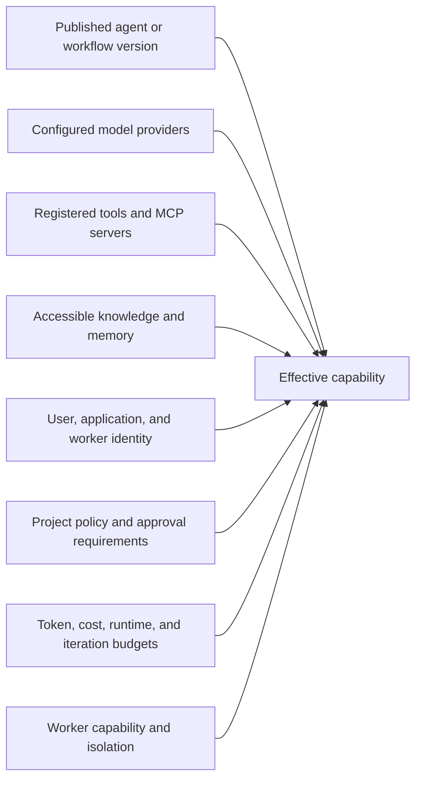

# Personas and Use Cases

## Current-state notice

Corex AgentOS is currently being initialized. This document describes the
intended users and outcomes across the complete [roadmap](../../ROADMAP.md).
It must not be read as a list of functionality available today.

## Who can use Corex AgentOS

```mermaid
flowchart TB
    Platform["Corex AgentOS"]
    Builders["Builders"] --> Platform
    Operators["Operators and governors"] --> Platform
    Consumers["Applications and end users"] --> Platform
    Ecosystem["Partners and contributors"] --> Platform

    Builders --> AgentDev["Agent developer"]
    Builders --> AppDev["Application developer"]
    Builders --> WorkflowDev["Workflow designer"]
    Builders --> IntegrationDev["Integration developer"]
    Builders --> DataEng["Knowledge and data engineer"]

    Operators --> PlatformEng["Platform engineer"]
    Operators --> SRE["SRE or operations engineer"]
    Operators --> Security["Security administrator"]
    Operators --> Approver["Human approver"]
    Operators --> Evaluator["QA and evaluation engineer"]
    Operators --> Auditor["Auditor or compliance reviewer"]
    Operators --> FinOps["FinOps or business owner"]

    Consumers --> Product["AI-enabled product"]
    Consumers --> EndUser["Authorized end user"]

    Ecosystem --> SI["Consultancy or systems integrator"]
    Ecosystem --> Vendor["Model, MCP, data, or cloud partner"]
    Ecosystem --> Contributor["Open-source contributor"]
```

## Persona catalog

### 1. Agent developer

Builds and improves agents that call models and tools.

Can eventually:

- define agent name, instructions, input, and structured output;
- select allowed models and fallback behavior;
- register local or MCP tools with JSON Schema inputs;
- run an agent locally or through the control plane;
- stream output and cancel execution;
- inspect model calls, tool calls, errors, tokens, latency, and cost;
- publish immutable agent versions;
- compare versions and run evaluations;
- debug a failed or unexpected response from its trace;
- share a stable agent version with applications and workflows.

Primary releases: v0.1, v0.2, v0.5, and v0.7.

### 2. Application developer

Adds agent capabilities to a product or internal application.

Can eventually:

- invoke published agents and workflows through Python, Go, TypeScript, or REST;
- provide typed input and consume structured output;
- stream execution progress;
- pass correlation and idempotency identifiers;
- cancel runs and inspect terminal outcomes;
- receive signed lifecycle webhooks;
- handle stable public errors and API versions;
- link application users to relevant Corex run traces;
- choose synchronous or asynchronous integration patterns.

Primary releases: v0.1, v0.2, and v0.8.

### 3. Workflow designer

Coordinates multiple agents, tools, conditions, and approvals.

Can eventually:

- define sequential and parallel workflow nodes;
- declare dependencies and input/output mappings;
- add agent, tool, condition, and approval nodes;
- validate a directed acyclic graph before publication;
- publish immutable workflow versions;
- configure retries, timeouts, cancellation, and failure propagation;
- run workflows manually or on schedules;
- pause and resume durable workflows;
- view live DAG execution and node attempts;
- safely replay from an allowed point with changed versions.

Primary releases: v0.3, v0.5, and v0.7.

### 4. Integration developer

Connects models, tools, systems, and observability backends.

Can eventually:

- implement a model-provider adapter;
- expose an external system as an MCP server;
- register and test MCP server connections;
- publish tool schemas and normalized errors;
- build vector-store, evaluator, guardrail, authentication, or telemetry plugins;
- run compatibility and contract tests;
- document permissions, side effects, timeouts, and retry behavior;
- distribute portable integrations without coupling them to one agent.

Primary releases: v0.1, v0.4, and v0.8.

### 5. Knowledge and data engineer

Provides controlled information sources for retrieval-augmented agents.

Can eventually:

- register file, document, repository, API, or structured-record sources;
- configure ingestion, chunking, embeddings, and reranking;
- use PostgreSQL with pgvector as the initial vector store;
- test retrieval relevance and source attribution;
- control project access to knowledge sources;
- inspect retrieval operations within execution traces;
- manage run, conversation, agent, and persistent memory interfaces;
- replace storage adapters without rewriting agents.

Primary release: v0.4. Some advanced stores are beyond the initial scope.

### 6. Platform engineer

Provides a shared agent platform to product teams.

Can eventually:

- deploy and configure the control plane, runtime workers, and portal;
- create projects and project-scoped credentials;
- configure PostgreSQL, NATS, Redis, ingress, TLS, and telemetry;
- manage worker pools, capabilities, concurrency, and draining;
- set organization-wide platform defaults;
- integrate identity, secrets, and observability systems;
- plan upgrades, migrations, backup, and disaster recovery;
- provide internal SDK and workflow standards.

Primary releases: v0.2, v0.6, v0.9, and v1.0.

### 7. SRE or operations engineer

Keeps agent workloads available, diagnosable, and efficient.

Can eventually:

- monitor API, queue, worker, database, and provider health;
- inspect run and workflow traces;
- view throughput, latency, failures, retries, and queue depth;
- drain unhealthy workers and recover abandoned tasks;
- diagnose model, MCP server, or network degradation;
- configure telemetry exporters and alerts;
- compare runs and investigate regressions;
- execute documented backup, recovery, and upgrade procedures.

Primary releases: v0.6, v0.7, v0.9, and v1.0.

### 8. Security administrator

Defines and enforces how agents access models, tools, data, and credentials.

Can eventually:

- configure authentication and project-scoped access;
- define allow, deny, and require-approval policies;
- restrict agents to specific models, tools, MCP servers, and projects;
- classify sensitive or side-effecting actions;
- configure budgets, rate limits, secret handling, and guardrails;
- rotate credentials and review access history;
- inspect audit records and policy decisions;
- integrate enterprise identity providers after the initial releases.

Primary releases: v0.2, v0.5, v0.9, and v1.0.

### 9. Human approver

Reviews actions that policy prevents an agent from taking autonomously.

Can eventually:

- receive an approval request for an authorized project;
- see the requesting agent, operation, reason, and normalized arguments;
- understand risk and relevant policy before deciding;
- approve, reject, or allow a request to expire;
- require a new decision if material arguments change;
- see whether an approved operation succeeded;
- review a complete history of their approval decisions.

Primary release: v0.5.

### 10. QA and evaluation engineer

Measures quality and prevents regressions between agent or workflow versions.

Can eventually:

- create evaluation datasets and test cases;
- define deterministic, LLM-based, or custom evaluators;
- run candidate and baseline versions against the same dataset;
- score correctness, quality, safety, latency, tokens, and cost;
- inspect failed cases and traces;
- enforce release thresholds;
- track evaluation trends across versions;
- export or integrate evaluation results into delivery processes.

Primary releases: v0.5, v0.7, and v0.8.

### 11. Auditor or compliance reviewer

Reviews evidence without changing runtime configuration.

Can eventually:

- read agent and workflow version histories;
- inspect policy and human-approval decisions;
- trace which models, tools, credentials, and data sources were used;
- review timestamps, actors, errors, and execution outcomes;
- inspect audit logs and security-relevant changes;
- export approved evidence subject to retention and access policy;
- verify that sensitive actions followed required controls.

Primary releases: v0.5, v0.9, and post-v1 compliance enhancements.

### 12. FinOps analyst or business owner

Controls economic usage and evaluates operational value.

Can eventually:

- view tokens and estimated model cost by run, agent, workflow, model, or project;
- configure token, cost, runtime, iteration, and tool-call budgets;
- compare quality, cost, and latency across versions;
- identify expensive workflows or model choices;
- track usage trends and allocation by project;
- review whether automated work meets business and cost objectives.

Primary releases: v0.1, v0.5, and v0.7.

### 13. Project owner or team administrator

Manages a team's Corex resources and access.

Can eventually:

- create and configure a project;
- invite or remove project members;
- assign project roles;
- manage project API keys and service accounts;
- register approved models, tools, credentials, and knowledge sources;
- publish or retire agent and workflow versions;
- review project runs, usage, policies, and settings;
- control which resources applications may invoke.

Primary releases: v0.2 and later authorization hardening.

### 14. AI product manager or product owner

Owns the outcome delivered by an agent-enabled product.

Can eventually:

- define the workflow outcome and acceptance criteria;
- review version, evaluation, reliability, and cost comparisons;
- inspect representative runs without accessing secrets;
- approve release thresholds with technical and governance owners;
- understand where users encounter failures or approval delays;
- prioritize improvements using observed run and evaluation evidence.

Primary releases: v0.2, v0.5, and v0.7.

### 15. Consultancy or systems integrator

Designs and delivers Corex deployments for customers.

Can eventually:

- create reusable reference architectures and integrations;
- deploy self-hosted environments;
- build agents and workflows for defined customer outcomes;
- connect customer identity, data, models, MCP servers, and telemetry;
- test security, reliability, and upgrades;
- operate supported environments under an agreed responsibility model;
- contribute reusable fixes, examples, and adapters upstream.

Primary releases depend on the delivered solution; production delivery targets
v1.0.

### 16. Technology partner

Provides a model, MCP server, data platform, cloud service, or operational tool.

Can eventually:

- build and maintain a compatible adapter or MCP integration;
- complete security, compatibility, and operational validation;
- publish documentation and examples;
- participate in joint solutions and reference architectures;
- provide support and escalation paths;
- measure integration adoption without accessing customer content.

See the [Partner Program](../business/partner-program.md).

### 17. Open-source contributor

Improves the platform, documentation, integrations, or tests.

Can:

- propose architecture changes through issues, discussions, and ADRs;
- implement runtime, provider, tooling, SDK, portal, testing, or documentation
  changes;
- add examples and compatibility tests;
- review code and documentation under project governance;
- help maintain integrations and community support.

Contribution workflows depend on repository governance documents as they are
introduced.

### 18. Application or service account

Represents a non-human application calling Corex APIs.

Can eventually:

- invoke only explicitly permitted agent or workflow versions;
- create runs with idempotency and correlation identifiers;
- read only the runs and outputs within its project scope;
- receive webhooks using validated signatures;
- rotate credentials without changing agent definitions;
- operate under smaller permissions than a human developer.

Primary releases: v0.2 and v0.8.

### 19. Runtime worker identity

Represents a Corex execution worker, not a person.

Can eventually:

- register capabilities and heartbeat status;
- claim eligible work;
- read the immutable execution bundle required for one attempt;
- resolve only authorized runtime credentials;
- emit events, telemetry, results, and usage;
- acknowledge, fail, or release work;
- never administer users, projects, or unrelated runs.

Primary release: v0.6.

### 20. Authorized end user

Uses an application powered by Corex rather than administering Corex directly.

Can, depending on the application:

- submit a task or question;
- receive streamed or structured results;
- see execution progress selected by the application;
- cancel their active task;
- provide requested human input;
- view safe source or trace information exposed by the product.

The application—not Corex alone—defines the end-user experience and permissions.

## Representative use cases

### Software engineering

- Analyze a repository and answer engineering questions.
- Triage a GitHub issue and propose a patch.
- Run tests and request approval before suggesting a pull request action.
- Compare agent versions against a repository task dataset.

### Research and knowledge work

- Search approved documents and repositories.
- Produce an answer with retrievable source context.
- Coordinate research, analysis, and review agents.
- Evaluate retrieval quality and output consistency.

### Internal operations

- Read structured records and prepare an action recommendation.
- Route sensitive actions through policy and human approval.
- Schedule repeat workflows with durable state.
- Produce an auditable timeline of decisions and tool activity.

### Platform standardization

- Give multiple product teams one model and tool abstraction.
- Centralize project-scoped credentials and policy.
- Operate shared runtime workers.
- Track reliability, usage, tokens, and cost across projects.

### Integration delivery

- Expose an existing service through MCP.
- Add a model-provider adapter.
- Connect a vector store, evaluator, guardrail, identity provider, or telemetry
  exporter.
- Package a validated self-hosted reference deployment.

## What determines what an agent can do

Connecting a powerful tool does not automatically grant it to every agent.
Actual capability is the intersection of configuration, identity, policy,
budget, runtime availability, and human approval.

## What users cannot assume

- Corex does not provide a foundation model.
- Corex does not make model output correct or safe automatically.
- Corex does not grant permission merely because a model requests a tool.
- Corex does not replace application-specific user authorization.
- Corex does not guarantee external models, MCP servers, or data sources are
  available or trustworthy.
- Corex does not blindly replay side-effecting operations.
- Corex does not replace Kubernetes, CI/CD, an IDE, or a general cloud platform.
- A feature listed for a future release cannot be treated as currently shipped.

## Related documents

- [Complete Capability Catalog](capability-catalog.md)
- [Roles and Permissions](roles-and-permissions.md)
- [User and Operator Flows](../architecture/user-flows.md)
- [Commercialization Strategy](../business/commercialization-strategy.md)
