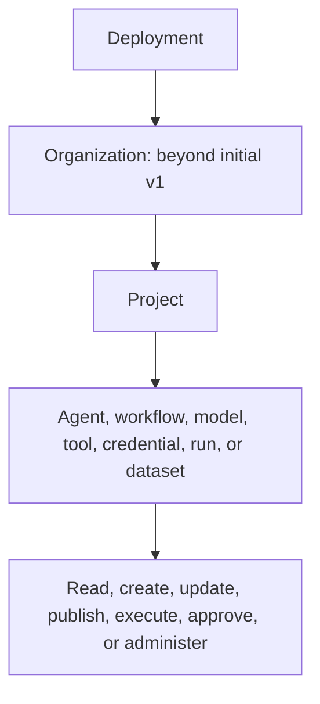
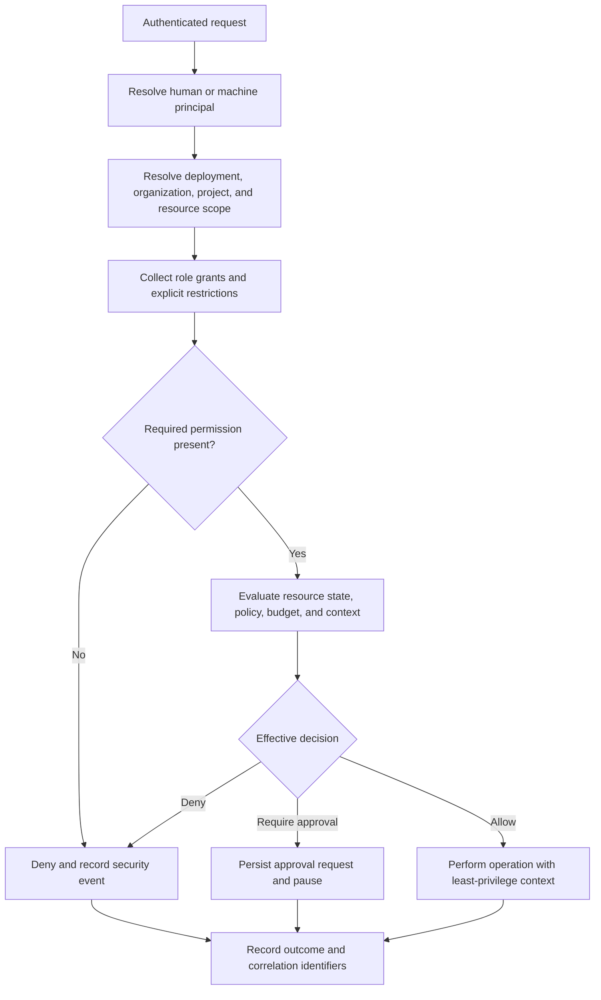
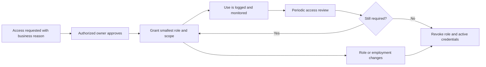

# Roles and Permissions

## Status

This is a proposed authorization model for design and review. Initial local
execution does not require the full model. Project access begins in v0.2 and is
hardened into RBAC by v0.9; organization-level controls extend beyond v1.0.

## Principles

- Deny by default.
- Assign permissions to roles, not directly to individual code paths.
- Scope access to the smallest project, resource, and action.
- Separate administration, development, approval, audit, and execution duties.
- Do not inherit a human creator's full permissions into an agent.
- Evaluate tool permission immediately before invocation.
- Use short-lived, workload-specific credentials for workers.
- Record security-relevant grants, changes, and decisions.

## Scope hierarchy

Until organizations are implemented, deployments contain projects directly.

## Human roles

### System administrator

Deployment-wide infrastructure administrator.

- Configure platform settings, identity integration, and system-level secrets.
- Manage platform health, upgrades, and backup operations.
- Create or recover project administrators under controlled procedures.
- Cannot automatically read project content or use project credentials unless
  separately granted.

### Organization administrator

Planned beyond the initial v1 scope.

- Manage organization membership, projects, defaults, and enterprise policy.
- Assign organization and project administrators.
- Review organization-level usage and compliance exports.

### Project owner

Accountable administrator for one project.

- Manage members and roles.
- Manage project settings, keys, credentials, and resource registration.
- Publish and retire agent or workflow versions.
- Configure project policy and budgets.
- Read project runs, usage, evaluations, and audit metadata.
- Delete or archive project resources subject to retention policy.

### Project developer

Builds and tests project resources.

- Create and update draft agents and workflows.
- Register permitted models and tools when granted.
- Execute development runs.
- Read runs created by the project according to content policy.
- Create evaluation datasets and candidate evaluations.
- Cannot manage members, unrestricted credentials, or audit policy.

### Workflow operator

Runs published resources without modifying their definitions.

- Start, cancel, retry, or resume authorized runs.
- View execution state, logs, traces, and outputs.
- Manage schedules when explicitly granted.
- Cannot publish definitions or alter policy.

### Approver

Makes scoped human-approval decisions.

- Read pending requests within assigned project, policy, tool, or resource scope.
- Approve or reject exact requests.
- Read outcomes of their decisions.
- Cannot change the requested arguments or approve outside assigned scope.

### Evaluator

Owns quality evidence and release checks.

- Manage datasets, test cases, evaluators, and evaluation runs.
- Compare candidate and baseline versions.
- Configure evaluation thresholds when granted.
- Cannot change production agent configuration solely through evaluator access.

### Auditor

Read-only evidence role.

- Read version history, runs, policy decisions, approvals, audit records, and
  approved telemetry.
- Export evidence where permitted.
- Cannot execute, approve, modify, or delete platform resources.

### Billing or usage viewer

- Read token, cost, usage, and allocation views.
- Read only the configuration metadata needed to explain usage.
- Cannot access raw prompts, tool payloads, credentials, or change resources.

### Project viewer

- Read non-sensitive project metadata and explicitly allowed runs.
- Cannot create runs or modify resources.

## Machine roles

### Application service account

- Invoke an allowlist of published agents or workflows.
- Read its permitted runs and outputs.
- Cancel runs it owns when granted.
- Receive signed webhooks through configured endpoints.
- Cannot publish definitions or enumerate credentials.

### CI or evaluation service account

- Publish candidates only if the delivery policy permits it.
- Start evaluation suites and read results.
- Enforce release gates through a narrow API permission.
- Cannot invoke production side-effecting tools by default.

### Runtime worker

- Register health and declared capabilities.
- Claim eligible attempts.
- Read one scoped execution bundle.
- Resolve only credentials referenced by that bundle.
- Emit events, telemetry, results, and usage.
- Acknowledge or fail claimed work.
- Cannot administer projects, users, policies, or unrelated runs.

### Scheduler

- Read enabled schedules and their immutable resource versions.
- Create idempotent run occurrences.
- Update schedule execution metadata.
- Cannot modify the workflow definition or bypass policy.

### Event projector

- Consume approved event subjects.
- Deduplicate and update designated read models.
- Cannot issue execution commands or read secret values.

### Integration identity

- Connect to one model provider, MCP server, data source, or telemetry backend.
- Receive only the credential and network access required for that integration.
- Cannot reuse its grant for another external system.

## Permission domains

| Domain | Example actions |
| --- | --- |
| Project | `project.read`, `project.update`, `project.delete` |
| Membership | `member.list`, `member.invite`, `member.role.assign`, `member.remove` |
| Agent | `agent.create`, `agent.update`, `agent.publish`, `agent.retire`, `agent.execute` |
| Workflow | `workflow.create`, `workflow.update`, `workflow.publish`, `workflow.execute`, `workflow.schedule` |
| Run | `run.create`, `run.read`, `run.content.read`, `run.cancel`, `run.retry`, `run.replay` |
| Model | `model.register`, `model.configure`, `model.use`, `model.usage.read` |
| Tool and MCP | `tool.register`, `tool.configure`, `tool.use`, `mcp.connect`, `mcp.discover` |
| Credential | `credential.create`, `credential.rotate`, `credential.assign`, `credential.metadata.read` |
| Policy | `policy.read`, `policy.create`, `policy.update`, `policy.simulate` |
| Approval | `approval.read`, `approval.decide`, `approval.audit.read` |
| Knowledge | `source.register`, `source.ingest`, `source.query`, `source.delete` |
| Evaluation | `evaluation.create`, `evaluation.run`, `evaluation.read`, `evaluation.gate.manage` |
| Audit | `audit.read`, `audit.export`, `retention.manage` |
| Operations | `worker.read`, `worker.drain`, `queue.read`, `deployment.admin` |
| Usage | `usage.read`, `cost.read`, `budget.manage` |

Permission names are illustrative until formal API and policy schemas are
published.

## Default role matrix

Legend: **A** administer, **W** create/change, **X** execute/operate, **R** read,
**D** decide approval, and **-** no default access.

| Resource | System admin | Project owner | Developer | Operator | Approver | Evaluator | Auditor | Usage viewer |
| --- | ---: | ---: | ---: | ---: | ---: | ---: | ---: | ---: |
| Project settings | A | A | R | R | R | R | R | R |
| Membership and roles | A | A | - | - | - | - | R | - |
| Agent drafts | - | A | W | R | R | R | R | - |
| Agent versions | - | A | W/R | X/R | R | X/R | R | R |
| Workflow drafts | - | A | W | R | R | R | R | - |
| Workflow versions | - | A | W/R | X/R | R | X/R | R | R |
| Models and tools | A | A | W/R | X/R | R | X/R | R | R |
| Credential values | A* | A* | - | - | - | - | - | - |
| Credential metadata | A | A | R | R | R | R | R | - |
| Runs and outputs | - | A | X/R | X/R | R | X/R | R | R* |
| Policies | A | A | R | R | R | R | R | - |
| Approval decisions | - | R | - | R | D/R | R | R | - |
| Evaluation datasets | - | A | W/R | R | R | A | R | - |
| Audit records | A | A | - | - | R* | R* | R | - |
| Usage and cost | A | A | R | R | - | R | R | R |
| Workers and queues | A | R | - | X/R | - | - | R | R |

`A*` means access occurs through controlled secret operations; raw stored values
should not normally be readable. `R*` means filtered to the role's necessary
scope and content policy.

## Authorization decision flow

## Tool authorization flow

Tool execution needs two separate checks:

1. The invoking user or service account may execute the selected agent or
   workflow.
2. The resolved agent/workflow version may use the requested tool with the
   requested resource and arguments under current policy.

Human permission to run an agent does not automatically grant the agent every
permission held by that human.

## Separation-of-duties examples

- A developer creates a candidate; an evaluator runs regression tests; a
  project owner publishes it.
- An agent requests a production change; a separately authorized approver
  decides; a scoped integration identity executes it.
- A platform administrator operates infrastructure; an auditor reads project
  evidence; neither receives raw project credentials by default.
- A service account invokes one published workflow; it cannot edit that
  workflow or expand its tool access.

## Emergency access

Production emergency access should be time-limited, approved, strongly
authenticated, narrowly scoped, and fully audited. It must not become a shared
permanent administrator credential. Every use receives a post-event review.

## Role lifecycle

## Related documents

- [Personas and Use Cases](personas-and-use-cases.md)
- [Complete Capability Catalog](capability-catalog.md)
- [Security Model](../architecture/security-model.md)
